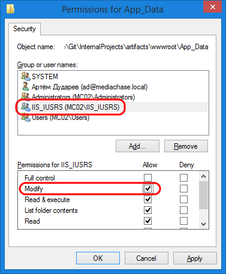
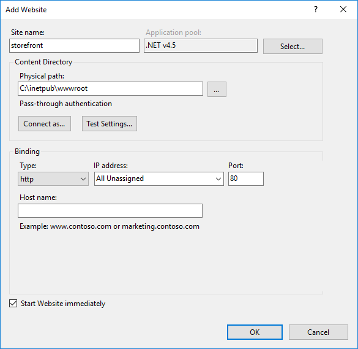

---
aliases:
  - docs/lessons/lesson1
date: '2018-03-20'
layout: docs
title: 'Lesson 1'

---
## Summary

Use this guide to <a class="crosslink" href="https://virtocommerce.com/ecommerce-hosting" target="_blank">deploy</a> and configure precompiled Virto Commerce Platform and Virto Commerce Storefront.

## Prerequisites

* <a href="https://www.microsoft.com/en-us/download/details.aspx?id=5842" target="_blank">Windows Server 2008 R2 SP1 or later</a>(for Platform and Storefront)
* <a href="https://helpdeskgeek.com/windows-7/turn-on-microsoft-internet-information-services-in-windows-7/" target="_blank">Enable Internet Information Services 7 or later</a>(for Platform and Storefront)
* <a href="https://www.microsoft.com/en-us/download/details.aspx?id=49981" target="_blank">Microsoft .NET Framework 4.6.1</a>(for Platform and Storefront)
* <a href="https://www.microsoft.com/en-us/sql-server/sql-server-downloads" target="_blank">Microsoft SQL Server 2008 or later with SQL Management Studio</a>(for Platform and Storefront)
* <a href="https://go.microsoft.com/fwlink/?LinkId=746572" target="_blank">Visual C++ Redistributable Packages for Visual Studio</a>(for Storefront only)

## Initial configuration of VirtoCommerce Platform (Runtime version).

Navigate to the <a href="https://github.com/VirtoCommerce/vc-platform/releases" rel="nofollow">Releases section of Virto Commerce Platform in GitHub.</a>

You will find **VirtoCommerce.Platform.2.x.x.zip** file. In this file the site has already been built and can be run without additional compilation. It does not includes all the source code.

Unpack follow zip to the web server in IIS application root directory **C:\inetpub\wwwroot\admin**. If there is no **admin** directory inside **wwwroot**, create it.

## Setup of Virto Commerce Platform

### Configure connection strings

* Open the **C:\inetpub\wwwroot\admin\Web.config** file in a text editor.
* In the **connectionStrings** section change **add** nodes:
  * **VirtoCommerce**: parameters for  SQL server database. Search the name of SQL Server: Start > Windows Administartive Tools > Services > search in list SQL Server(...) - name is in round brackets. Change (local) to .\Name-Of-SQL-Server like .\SQLEXPRESS. 
    ```
    <add name="VirtoCommerce" connectionString="Data Source=(local);Initial Catalog=VirtoCommerce2;Persist Security Info=True;User ID=virto;Password=virto;MultipleActiveResultSets=True;Connect Timeout=420" providerName="System.Data.SqlClient" />
    ```

### Create virto user in SQL Server Manager

* Open SQL Server Manager and connect to the local sql server on Database Engine. Add to Security/Logins new login name virto with password virto, give him in Server Roles dbcreator and public roles.

### Configure permissions for App_Data folder of VirtoCommerce Platform (optional)

Open properties for **C:\inetpub\wwwroot\admin\App_Data** folder and give permission **Modify** to **IIS_IUSRS** user group.



### Configure IIS (optional)

* Open the **IIS Manager** and create a new website or new application named **admin** inside an existing website.
* In the **Physical path** field enter the full path to the platform site data folder **C:\inetpub\wwwroot\admin**

* Select application pool which uses **.NET CLR Version 4.0** and **Integrated** pipeline mode:

* Inside the admin application add the new virtual directory with alias **assets** and physical path **C:\inetpub\wwwroot\admin\App_Data\Assets**. If there is no **Assets** directory inside **App_Data**, create it.


## First sign in

* Open the Virto Commerce Platform application in the browser - in  the **IIS Manager** select **admin** and click on right column to "Browse *:80(http)".
* **On the first request the application will create and initialize Virtocommerce2 database**.
* After that you should see the sign in page.


* Use the following credentials:
  * Login: **admin**
  * Password: **store**

## Modules auto installation

* Next step - platform modules auto installation, after that you should click the **Restart** button.


## Sample data installation

* After restart you should see next page with possibillity to sample data installation(you can choose empty option with no products or Electronics option - new products would be added to your Virtocommerce2 database )


### Change administrator password

* In the left menu select **More > Configuration > Security**.
* Select **Users**
* Select the **admin** user.
* Click **Change password**.
* Enter the new password twice and click **OK**.

### Change API credentials for storefront application

* In the left menu select **More > Configuration > Security**.
* Select **Users**
* Select the **frontend** user.
* Click the **API Keys** widget.
* Select the **Frontend Hmac** key
* Click **Generate**, then **OK**, then **Save**.

## Initial configuration of VirtoCommerce Storefront (Runtime version).

Navigate to the <a href="https://github.com/VirtoCommerce/vc-storefront/releases">Releases section of Virto Commerce Storefront in GitHub.</a>

You will find **VirtoCommerce.Storefront.2.x.x.zip** file. In this file the site has already been built and can be run without additional compilation. It does not includes all the source code.

Create new folder named **storefront** in IIS application root directory **C:\inetpub\wwwroot** and unpack this zip to this folder of web server.

## Setup of Virto Commerce Storefront

### Configure Web API base URL (optional)

* Open the **C:\inetpub\wwwroot\storefront\Web.config** in a text editor.
* In the **connectionStrings** section find the **add** node named **VirtoCommerceBaseUrl**. Change its **connectionString** attribute value to the URL of your **VirtoCommerce Platform** application - **http://localhost/admin**.

### Configure Web API credentials (optional)

* Open the **C:\inetpub\wwwroot\storefront\Web.config** in a text editor.
* In the **appSettings** section find the **add** nodes named **vc-public-ApiAppId** and **vc-public-ApiSecretKey** and if you need change its values to values generated in **VirtoCommerce Platform** application.

### Configure CMS content storage (optional)

* Open the **C:\inetpub\wwwroot\storefront\Web.config** in a text editor.
* In the **connectionStrings** section find the **add** node named **ContentConnectionString**. Change its **connectionString** attribute value to the path of folder specified in **CmsContentConnectionString** connection string in your **VirtoCommerce Platform** installation (**~/App_Data/cms-content** by default, i.e. you must use **provider=LocalStorage;rootPath=C:\inetpub\wwwroot\admin\App_Data\cms-content** connection string in this case).

### Configure permissions for App_Data folder of VirtoCommerce Storefront

Open properties for **C:\inetpub\wwwroot\storefront\App_Data** folder and give permission **Modify** to **IIS_IUSRS** user group:


### Configure IIS

* Open the **IIS Manager** and create a new website or new application inside an existing website.
* In the **Physical path** field enter the full path to the **C:\inetpub\wwwroot\storefront** folder:

* Select application pool which uses **.NET CLR Version 4.0** and **Integrated** pipeline mode:


## Add default Thema for **VirtoCommerce Storefront** 

* Copy folder **C:\inetpub\wwwroot\admin\App_Data\cms-content** to **C:\inetpub\wwwroot\storefront\App_Data**.

Now you could first open the **VirtoCommerce Storefront** application in the browser after full modules and sample data installation on **Virtocommerce Platform** - in  the **IIS Manager** select **storefront** and click on right column to "Browse *:80(http)".


