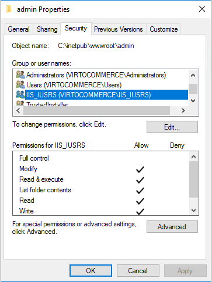
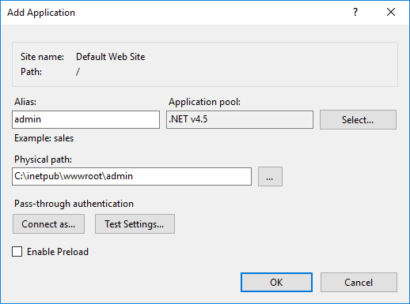
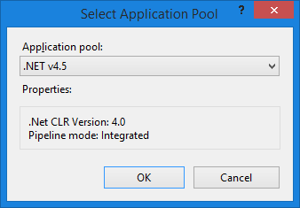
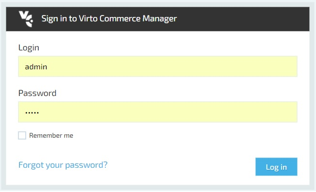
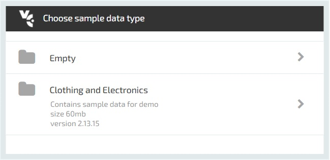
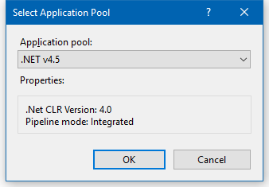

---
aliases:
  - docs/lessons/lesson1
date: '2018-03-20'
layout: docs
title: 'Lesson 1'

---
## Summary

Use this guide to <a class="crosslink" href="https://virtocommerce.com/ecommerce-hosting" target="_blank">deploy</a> and configure precompiled Virto Commerce Platform(backend) and Virto Commerce Storefront(frontend).

## Prerequisites

* <a href="https://www.microsoft.com/en-us/evalcenter/evaluate-windows-server-2016" target="_blank">Windows Server 2008 R2 SP1 or later</a>
* Enable Internet Information Services. You may use PowerShell command: Install-WindowsFeature -name Web-Server -IncludeAllSubFeature
* <a href="https://www.microsoft.com/en-us/download/details.aspx?id=49981" target="_blank">Microsoft .NET Framework 4.6.1</a>
* <a href="https://www.microsoft.com/en-us/evalcenter/evaluate-sql-server-2017-rtm" target="_blank">Microsoft SQL Server 2008 or later with SQL Management Studio(free MS SQL Express would be enough)</a>
* <a href="https://go.microsoft.com/fwlink/?LinkId=746572" target="_blank">Visual C++ Redistributable Packages for Visual Studio</a>

## Initial configuration of VirtoCommerce Platform.

Navigate to the <a href="https://github.com/VirtoCommerce/vc-platform/releases" rel="nofollow">Releases section of Virto Commerce Platform in GitHub.</a>

You will find **VirtoCommerce.Platform.2.x.x.zip** file.

Unpack follow zip to the web server in IIS application root directory **C:\inetpub\wwwroot\admin**. If there is no **admin** directory inside **wwwroot**, create it manually or with PowerShell commands:
* **$folder="C:\inetpub\wwwroot\admin"**
* **New-Item -ItemType directory -Path $folder -Force**

## Setup of Virto Commerce Platform

### Configure connection strings

* Open the **C:\inetpub\wwwroot\admin\Web.config** file in a text editor.
* In the **connectionStrings** section find the **add** node:
  * **VirtoCommerce**: parameters for  SQL server database. Change (local) to IP address of your SQL Server. For locally running instance SQL Express set Data Source=.\SQLEXPRESS. 
    ```
    <add name="VirtoCommerce" connectionString="Data Source=(local);Initial Catalog=VirtoCommerce2;Persist Security Info=True;User ID=virto;Password=virto;MultipleActiveResultSets=True;Connect Timeout=420" providerName="System.Data.SqlClient" />
    ```

### Create virto user in SQL Server Manager

* Open SQL Server Manager and connect to the local sql server on Database Engine. Add to Security/Logins new login name virto with password virto, give him in Server Roles dbcreator and public roles.

### Configure permissions for admin folder of VirtoCommerce Platform

Open properties for **C:\inetpub\wwwroot\admin** folder and give permission **Modify** to **IIS_IUSRS** user group.


* The same can be done with PowerShell commands:
* **$acl = Get-Acl $folder**
* **$acl.SetAccessRuleProtection($True, $True)**
* **Set-Acl -Path $folder -AclObject $acl**
* **$permission = "BUILTIN\IIS_IUSRS","Modify, Synchronize", "ContainerInherit, ObjectInherit", "None", "Allow"**
* **$accessRule = New-Object System.Security.AccessControl.FileSystemAccessRule $permission**
* **$acl.SetAccessRule($accessRule)**
* **$acl | Set-Acl $folder**

### Configure IIS

* Open the **IIS Manager** and create a new application named **admin** inside an existing **Default Web Site**.
* In the **Physical path** field enter the full path to the platform site data folder **C:\inetpub\wwwroot\admin**

* Select application pool which uses **.NET CLR Version 4.0** and **Integrated** pipeline mode:

* Inside the admin application add the new virtual directory with alias **assets** and physical path **C:\inetpub\wwwroot\admin\App_Data\Assets**. If there is no **Assets** directory inside **App_Data**, create it.


## First sign in

* Open the Virto Commerce Platform application in the browser - in  the **IIS Manager** select **admin** and click on right column to "Browse *:80(http)".
* **On the first request the application will create and initialize Virtocommerce2 database**. Wait a minute...
* After that you should see the sign in page.


* Use the following credentials:
  * Login: **admin**
  * Password: **store**

## Modules auto installation

* Next step - platform modules auto installation, after that you should click the **Restart** button.


## Sample data installation

* After restart you should see next page with possibillity to sample data installation(you should choose Closing and Electronics option - new products would be added to your Virtocommerce2 database )



### Change administrator password

* In the left menu select **More > Configuration > Security**.
* Select **Users**
* Select the **admin** user.
* Click **Change password**.
* Enter the new password twice and click **OK**.

### Change API credentials for storefront application

* In the left menu select **More > Configuration > Security**.
* Select **Users**
* Select the **frontend** user.
* Click the **API Keys** widget.
* Select the **Frontend Hmac** key
* Click **Generate**, then **OK**, then **Save**.

## Initial configuration of VirtoCommerce Storefront (frontend).

Navigate to the <a href="https://github.com/VirtoCommerce/vc-storefront/releases">Releases section of Virto Commerce Storefront in GitHub.</a>

You will find **VirtoCommerce.Storefront.2.x.x.zip** file.

Create new folder named **storefront** in IIS application root directory **C:\inetpub\wwwroot** manually or with PowerShell commands:
* **$folder="C:\inetpub\wwwroot\storefront"**
* **New-Item -ItemType directory -Path $folder -Force**
* and unpack this zip file to this folder of web server.

## Setup of Virto Commerce Storefront

### Configure Web API base URL

* Open the **C:\inetpub\wwwroot\storefront\Web.config** in a text editor.
* In the **connectionStrings** section find the **add** node named **VirtoCommerceBaseUrl**. Make sure that its **connectionString** attribute value is **http://localhost/admin**. 
    ```
    <add name="VirtoCommerceBaseUrl" connectionString="http://localhost/admin" />
    ```

### Configure CMS content storage

* Open the **C:\inetpub\wwwroot\storefront\Web.config** in a text editor.
* In the **connectionStrings** section find the **add** node named **ContentConnectionString**. Make sure that its **connectionString** attribute rootPath value is **~/App_Data/cms-content**.
    ```
    <add name="ContentConnectionString" connectionString="provider=LocalStorage;rootPath=~/App_Data/cms-content" />
    ```
 
### Configure IIS

* Open the **IIS Manager** and add a new application named **storefront** inside an existing **Default Web Site**.
* In the **Physical path** field enter the full path to the **C:\inetpub\wwwroot\storefront** folder:

* Select application pool which uses **.NET CLR Version 4.0** and **Integrated** pipeline mode:


## Add default themе for **VirtoCommerce Storefront** 

* Open the **IIS Manager** and add a new virtual directory named **cms-content** inside **C:\inetpub\wwwroot\storefront\App_Data**.
* Physical path is **C:\inetpub\wwwroot\admin\App_Data\cms-content**.
* The same can be done with PowerShell commands:
* **$folder="C:\inetpub\wwwroot\storefront\App_Data\cms-content"**
* **New-Item -ItemType directory -Path $folder -Force**
* **New-Item -Path C:\inetpub\wwwroot\storefront\App_Data\cms-content -ItemType SymbolicLink -Value C:\inetpub\wwwroot\admin\App_Data\cms-content**

Now you could first open the **VirtoCommerce Storefront** application in the browser after full modules and sample data installation on **Virtocommerce Platform** - in  the **IIS Manager** select **storefront** and click on right column to "Browse *:80(http)".


