Today we released the v1.2 update of the Virto Commerce. This is a big update of Virto Commerce and it includes some great new features and enhancements. It is also our first Open Source release which can be accessed using codeplex project at [http://virtocommerce.codeplex.com](http://virtocommerce.codeplex.com)!

These new capabilities include:

* **Import improvements**: reorganized to make it user friendly, support for localization import
* **Performance**: created load tests to add millions of products and orders, added fixes to interfaces
* **Marketing improvements**: improvements to expression builder, feature improvements
* **Asset management**: can now upload assets from within commerce manager, thumbnails are auto generated
* **Catalog improvements**: new delete dialogs for catalog and category
* **External login changes**: ability to associate multiple external accounts, remove association
* **Search indexing improvement**: search indexing performance, added additional scope parameters
* **General Code Clean up**: removed unity dependencies from core classes, improved base classes for better testing

In addition to these, we also fixed a lot of minor issues and bugs as well as improved SDK.

All of these SDK enhancements are now available to start using immediately and you can download SDK from [Virto Commerce downloads page](http://virtocommerce.com/try).

Below are more details on new enhancements.

#### Import improvements

We added ability to include templates when specifying values:

Also "Auto" option has been added to the column delimiter property while creating Import job.

If the option selected the import engine tries to guess which delimiter is used to separate columns in the imported file when template file is selected.

Another import improvement is added restrictions while creating import job. All required properties of the selected to import entity type should be provided with the values from the import file or by custom value.

Otherwise user won't be able to complete the import job wizard. Those properties marked with asterisk.

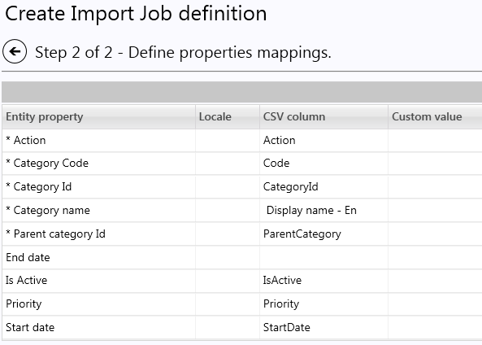

We added separate asset import option to import assets for items separately. So no matter how many images product has, you can import them all.

##### Price lists import

ItemId is no longer required field and prices can be imported when only item code is specified.

#### Performance

We paid a special attention to performance in this sprint. We created special sql scripts that allow adding millions of products and orders into Virto Commerce database. We then tested Virto Commerce manager UI's to make sure it supports such amounts of data.

We added missing indexes and optimized UI to support large catalogs. The data load scripts can be found in our source code under "tests" folder if you want to try them yourself.

##### Front-end is using output caching

The performance improvements were made to front end by introducing static content caching and full page output caching using custom version of MVC OutputCacheAttribute. The output cache can be disabled and configured in web.config file under StoreWebApp project:

`<caching>
  <outputCache enableOutputCache="true" />
  <outputCacheSettings>
    <outputCacheProfiles>
      <addname="CatalogCache" duration="30" varyByParam="*" />
      <addname="HomeCache" duration="30" varyByParam="*" varyByCustom="store" />
      <addname="SearchCache" duration="30" varyByParam="*" />
      <addname="BannerCache" duration="10" varyByParam="placeName" />
      <addname="AssetCache" duration="300" varyByParam="path" />
    </outputCacheProfiles>
  </outputCacheSettings>
</caching>`

The output cache can also be disabled in application settings using commerce manager.

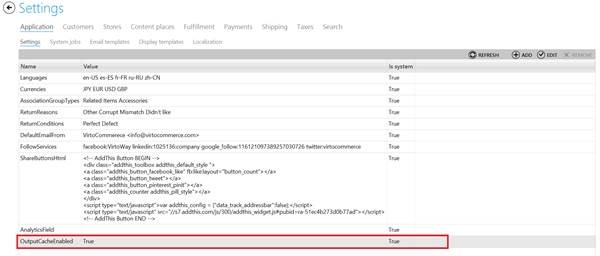

#### Marketing improvements

##### Expression Builders

Promotions expression builder's semantics has been improved. Cart promotion eligibilities group and rewards group are now required to have at least one child.

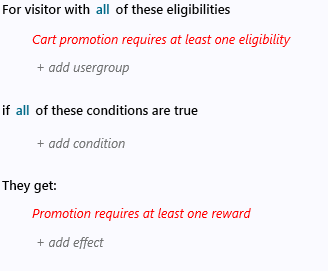

Catalog promotion conditions group and rewards group also has to have at least one child.

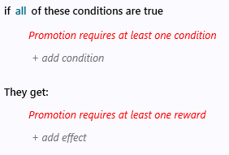

Otherwise validation won't be passed.

Another improvement is that virtual catalogs are now available to create promotions. Now catalogs that have price lists associated with them are displayed in the list of available during promotion creation. So if virtual catalog has at least one price list assigned to it, it will be available to choose in promotion wizard.

For cart promotion if the store is associated with the virtual catalog, items and categories of this catalog will be available while creating conditions related to items or categories.

##### Issues Fixed

* Promotion can be applied on specified category and entry
* Discount created in store is valid only in that store
* IsRegisteredUser group works
* IsFirstTimeBuyer condition works
* Promotions with sku reward when applied are removed in RemoveDiscountActivity

#### Localization user experience improvements

Localization home view user interface has been improved to be more consistent to the whole application and to become more intuitive. For example suggestions to select languages has been added in the filter pane. Auto-search functionality has been added, so after languages selection or search keyword entered the results are filtered automatically.

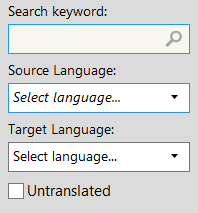

#### Asset management

* File upload feature added to "Asset browser" dialog. File can be uploaded to the remote storage (both azure and on-premise hosted file storage) in Commerce Manager directly. In order to upload a file click [Upload] button and select a file on Open file popup dialog. File is uploaded and asset list is refreshed.
* Added thumbnail generation and image asset preview. Images are common assets in the Commerce Manager. Whenever looking for an image, the preview picture gives much more information than just a plain asset name. That's why when an image asset is selected in "Asset browser" dialog, a small preview image is displayed on the left of the assets list.
* The performance of "Asset browser" improved. Image preview data is loaded "on demand".

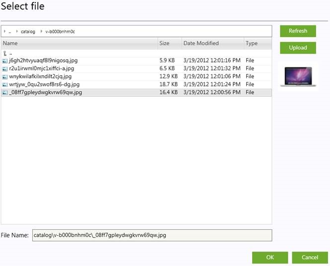

#### Catalog improvements

* Catalog and Virtual Catalog delete dialogs now provide more information: it shows Item count and Category count.
* An additional security field is introduced to Catalog and Virtual Catalog delete dialogs. Delete can proceed only if security field matches the beginning of Catalog name.
* Catalogs with all related data can be deleted in a single dialog.

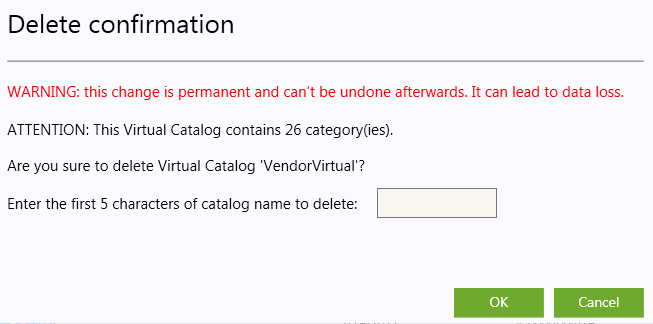

* Category delete dialog now provides more information: it shows Item count, sub-categories count and Linked Categories count.

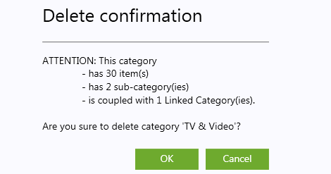

#### External Login Improvements

The external login feature has been improved so that user can now login using several external accounts and also associate them with internal account.

First select option to sign in using Google or Yahoo.

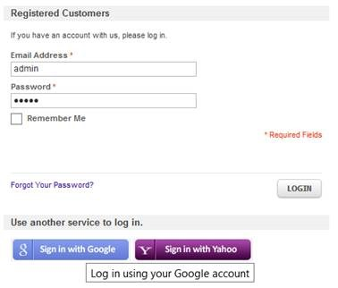

After specifiying external login credentials user can simply create account or can also create local account by specifying password. If such local account already exist user must enter password that matches exisitng local account password.

This way user can associate several external accounts to one user name.

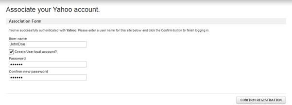

If user has any external accounts associated, they are displayed in my account dashboard. User can also dissociate external login from current account if there are more then one.

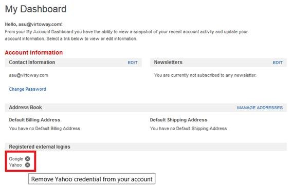

#### Search indexing improvements

We reworked some indexing functionality especially focusing on performance of indexing. Now indexes more efficiently request data from the database and use caching when appropriate which resulted in x10 faster indexing which was crucial  when testing our 1 million item catalogs.

##### New search job parameter

The new job parameter was introduced for Generate Search Index and Process Search Index.

The parameter specifies which search scope these jobs should use.

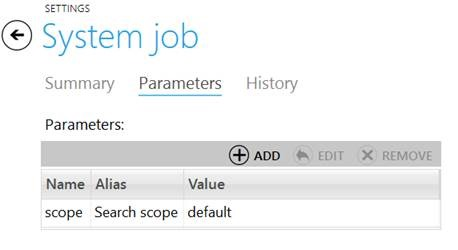

#### General Code Cleanup

* Refactored project to use `IViewModelsFactory<out T>` instead of more general `IViewModelsFactory`.
* All modules (except of Customers and Security) got rid of Unity dependency, modules are not referenced to Unity related libraries