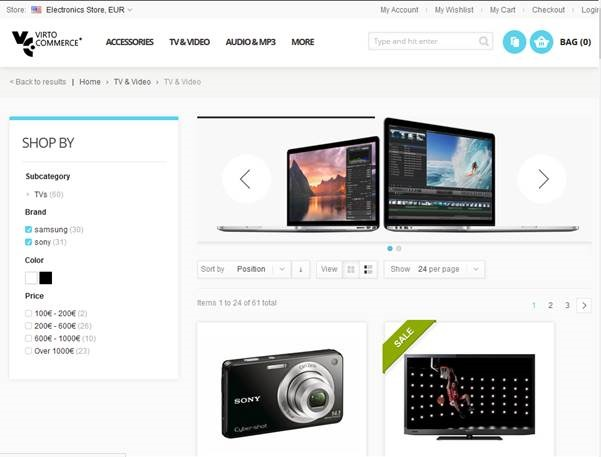
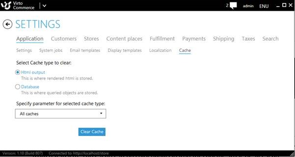
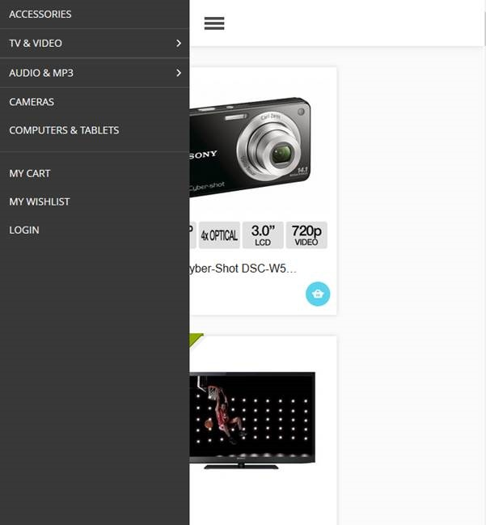

Since we haven’t posted updates for 1.10 release and 1.11 was just launched, this post will contain info on both of them.

Here is the list of new features:

* **Elastic Path 1.1.1** – we upgrade our elastic path providers to support 1.1.1 version (the previous one was an old 0.29 release). Lots of new functionality added (v1.10)
* **Multi-value “Or” Filtering** – filter results “”ability to use “or” filters of type “black”
* **Output cache clean up from Commerce Manager** – you can now reset cache from the Commerce Manager, for the cases when you want to see changes immediately (cache would reset itself after certain time)&nbsp (v1.10)
* **Commerce Manager localization** – admin now supports localization using the same methods as front end is (no compilation is done) (v1.10)
* **HTTPS access for web services** – we simplified how https can be configured for web services, to make managing your stores more secure (v1.10)
* **Permissions are now dynamic** – custom permissions can now be added to the database and then managed through the Commerce Manager (v1.10)
* **Migrated to MVC 5.2** – frontend, web services and web api have been updated to the latest MVC libraries
* **Improved Search Localization** – special language based index fields are created for each multi language property
* **Dynamic Content Razor Templates** – dynamic content like banners can now use Razor templates
* **Login status indicator** – special language based index fields are created for each multi language property
* **Order Statistics** – added job that recalculates statistics for the order dashboard
* [StackOverflow](http://stackoverflow.com/tags/virtocommerce) – we added new public community on StackOverflow, go ask your questions!

#### What’s next?

We currently working on the following features:

* Web based Admin/Commerce Manager
* Programmable promotions
* Multi channel features (eBay, Amazon integrations)
* Additional European payment gateways integrations
* We also helping our customers launch several B2B and B2C sites that will allow us to bring more features to a product
* Adding support for Azure WebJobs instead of separate Scheduler VM
* UI for B2B features, mainly to manage organization and users within them

We also launched a new Stackoverflow community dedicated to Virto Commerce. Use it Let us know at [http://help.virtocommerce.com/support/discussions/forums/264127](http://help.virtocommerce.com/support/discussions/forums/264127) if you’d like certain feature to be included in our roadmap.

#### “Or” based filters

The filtering has been improved. Now it is possible to filter items using multiple facets of the same kind. For example products can be filtered by brand “samsung” or “sony”. Also the new filter was introduced for subcategories. It will automatically show all direct child subcategories for current category.

#### Clear Cache through admin

The cache can be now cleared from Commerce Manager. There are two types of cache that can be cleared: html output cache (all rendered pages, sitemap) and database cache (objects retrieved from database). The cache can be selectively cleared for specific areas or all cache.

#### Sitemap improvements

There were some issues fixed related to sitemap. Also top menu categories are now created dynamically from database for current store and can be ordered using priority of categories.

#### Paypal improvements

There were fixes and improvements done to paypal express checkout. Now checkout will create order in database before redirecting to paypal payment site. When paypal redirects back it sends token that was saved in order payment. This allows finding correct order and continue checkout process.

#### More discount related fields added to order module

`AddColumn(“dbo.OrderForm”, “LineItemDiscountAmount”, c => c.Decimal(nullable: false, precision: 18, scale: 2));
AddColumn(“dbo.OrderForm”, “ShipmentDiscountAmount”, c => c.Decimal(nullable: false, precision: 18, scale: 2));
AddColumn(“dbo.OrderGroup”, “DiscountTotal”, c => c.Decimal(nullable: false, precision: 18, scale: 2));
AddColumn(“dbo.OrderGroup”, “FormDiscountTotal”, c => c.Decimal(nullable: false, precision: 18, scale: 2));
AddColumn(“dbo.OrderGroup”, “LineItemDiscountTotal”, c => c.Decimal(nullable: false, precision: 18, scale: 2));
AddColumn(“dbo.OrderGroup”, “ShipmentDiscountTotal”, c => c.Decimal(nullable: false, precision: 18, scale: 2));`

This allows more precisely store, identify and display orders when needed.

#### Design improvements

The mobile design has been improved. Now in mobile menu there are links to login, view cart and wish list.

