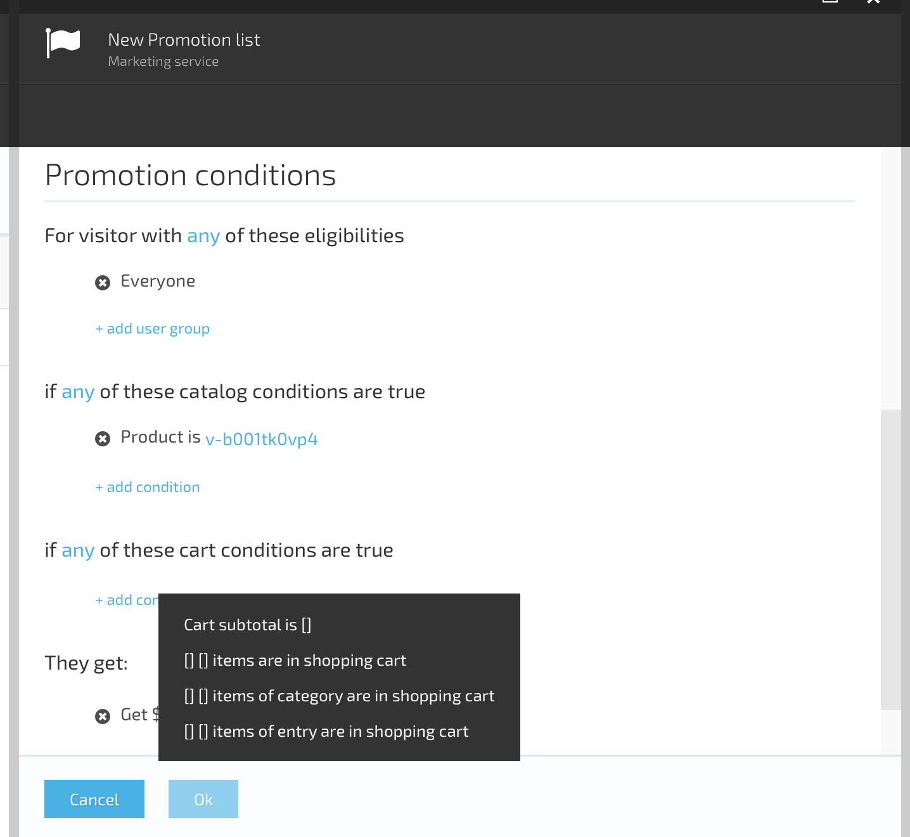
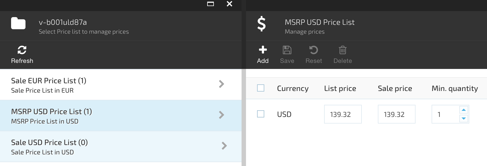
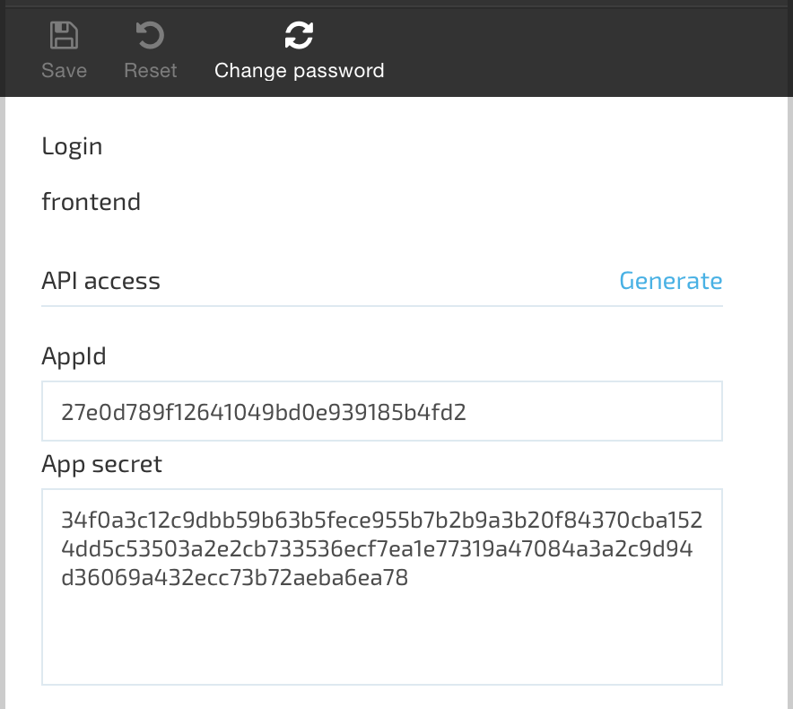
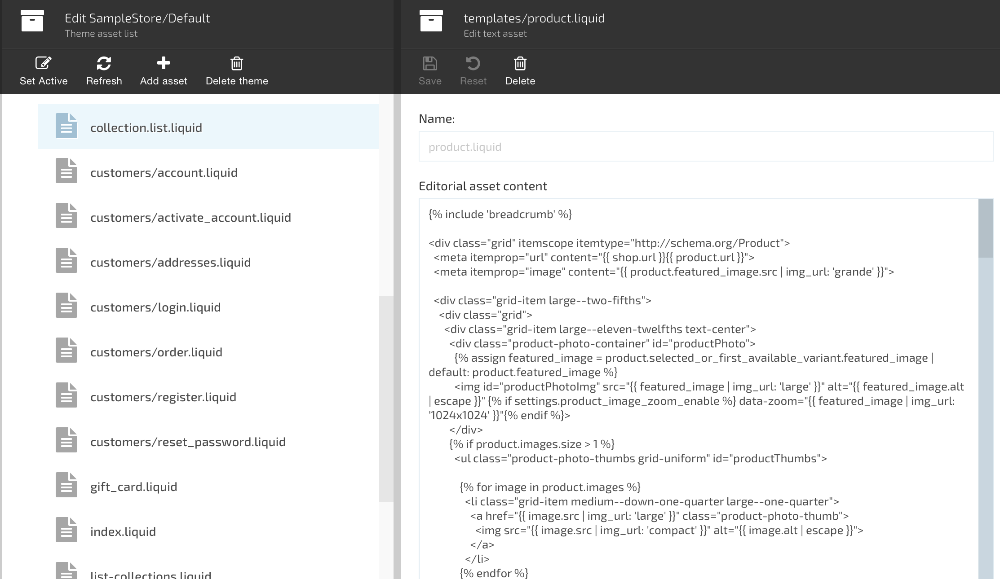
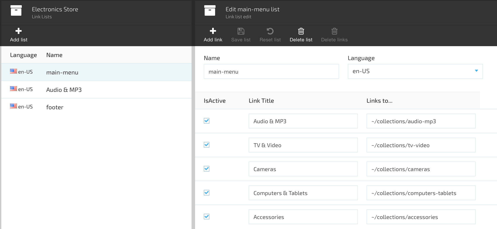
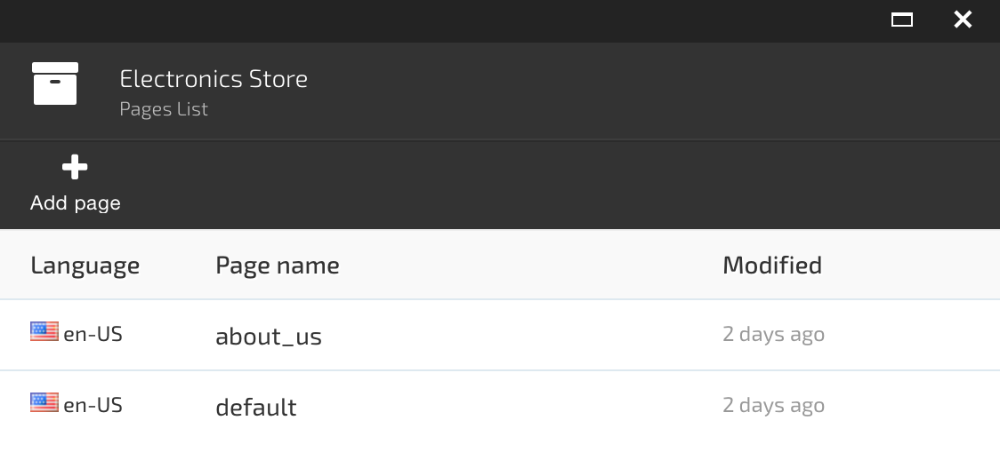
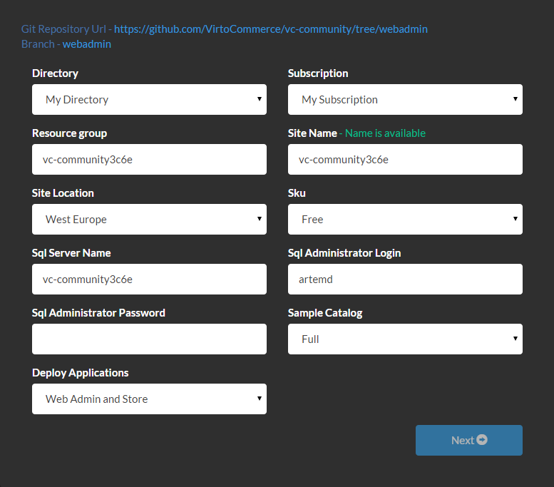

We have been working hard on the new 2.0 version and finally have some exciting things to show. Virto Commerce base platform is complete and new modules can be build in a flash of time.

In the past two weeks we delivered more visually noticable components than in the past 6 months, including promotions, dynamic content, themes, roles &amp; permissions, security and many more.

Here are some features we introduced during last sprint:

* **Promotions Discounts** – new promotion UI including angularjs based promotion expression builder
* **Price Lists** – define multiple price lists and add product prices
* **Roles and Permissions** - control roles and permissions for user accounts
* **API Security** - used to control what application can access Virto Commerce APIs
* **Themes** - create and modify existing themes right from the Commerce Manager
* **Navigation Menus** - create unlimited number of menues
* **Pages** - allows customer to create common pages like about us, terms and so on

#### What’s next?

We have many more features planned including:

* **App Store** - app store will be launched this month and will allow our partners to publish modules and themes
* **Store Samples** - we are working on more industry store samples that showcase specific functionality required by apparel, software, subscriptions and B2B stores
* **Recurring Orders** - support for subsciption based products
* **Amazon and Ebay Integration** - developed by our partner module will allow synchronizing products with popular marketplaces

#### Promotions &amp; Discounts

We improved and simplified how promotions are handled in 2.0. Instead of defining two types as we had in 1.13 (catalog and cart), we combined them together.

We also created a brand new web based expression builder which can also be easily extended with custom expressions.

#### Price Lists

Price lists allow adding multiple prices for products.

#### API Security

Generate App Id and App Secret that can then be used to connect to the APIs under user identity. You can then further specify permissions for that user which will be applied to the application connecting under that account.

#### Themes

Download and install themes per store and then customize templates, stylesheets and assets using Commerce Manager.

#### Navigation Menus

Define multiple navigation menus for top navigation, footers, side menus and many others.

#### Pages

Use pages to create simple about us, contact and terms pages. You can also embed page content inside other templates.

#### Development

[Setup source code](http://docs.virtocommerce.com/display/vc2devguide/Source+Code+Getting+Started) - describes how to get the latest source code and setup your development environment

#### Installation and Deployment

We created several guides that should help you both setup Virto Commerce on Microsoft Azure Cloud and on your own development machine. The setup takes only 10 minutes on Azure.

* [Install on Microsoft Azure Cloud](http://docs.virtocommerce.com/display/vc2devguide/Deploy+from+GitHub+to+Microsoft+Cloud+Azure) – checkout the installation guide on how to setup full version of Virto Commerce on free azure environment
* [Install on private server](http://docs.virtocommerce.com/display/vc2devguide/Deploy+web+applications+to+dedicated+server) – use this guide to setup Virto Commerce on your own server
* [Setup source code](http://docs.virtocommerce.com/display/vc2devguide/Source+Code+Getting+Started) - describes how to get the latest source code and setup your development environment