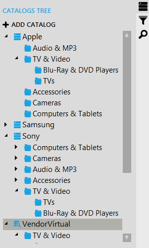
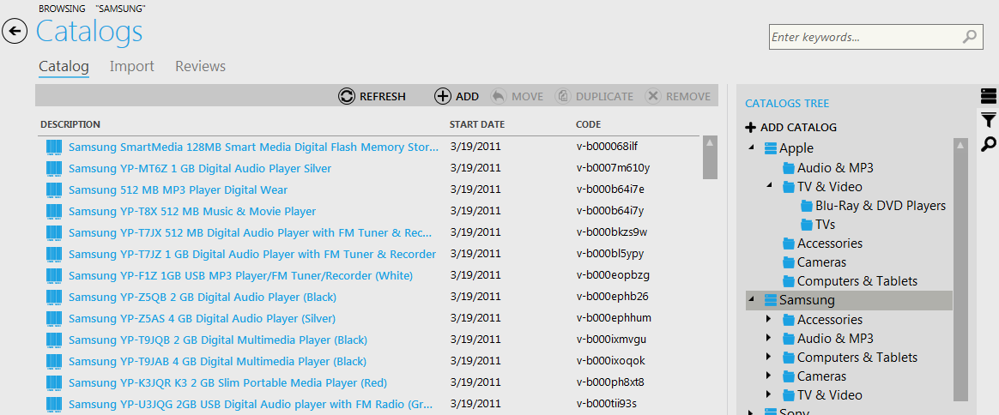
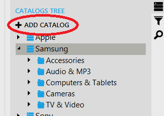
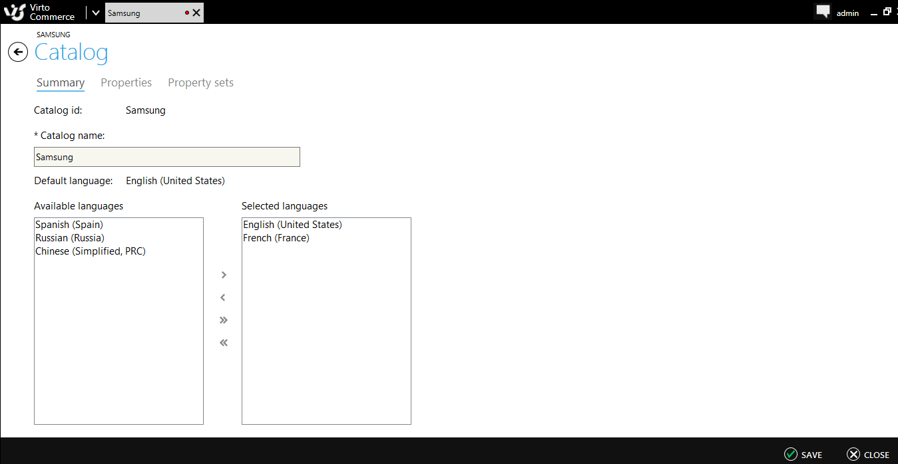
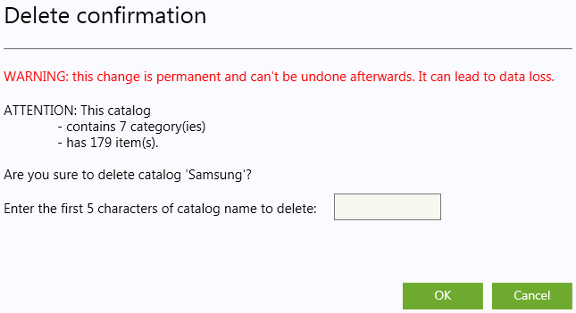

Virto Commerce マネージャーのメインメニューを使い、カタログブロックに移動します。

Commerce managerに存在する全てのカタログが表示され、ページの右型にカタログツリーが表示されます。必要なカタログに移動する為にツリーを利用します。

## カタログの作成

カタログを作成するには、カタログツリーのトップにある ADD CATALOG ボタンをクリックします。

作成するには、カタログ又はバーチャルカタログを選択し、OK ボタンをクリックします。その後、カタログプロパティ・デフォルト言語を定義するプロパティを入力します。作成されたカタログは、ツリーに表示されます。

カタログを編集する場合は、カタログを選択し、右クリックで表示されるメニューから "Open Catalog" オプションを選択します。次に、必要な変更を加え(例えば、カタログ・言語の名前を変更するなど)変更を適用するには、Save ボタンをクリックします。

## カタログの削除

カタログ(バーチャルカタログ)を削除するには、カタログツリーで右クリックし、表示されるメニューから "Delete" オプションを選択します。削除再確認ダイアログが表示されますので実行を行います。確認ダイアログは、カテゴリ数と項目数などの追加情報を表示します。

このダイアログには、追加のセキュリティフィールドが含まれています。セキュリティフィールドに入力した値が、カタログ名の先頭に一致している場合のみ削除処理が行われます。削除処理が実行された後、全ての関連データを含め削除されます。削除されたカタログは、カタログツリーに表示されなくなります。