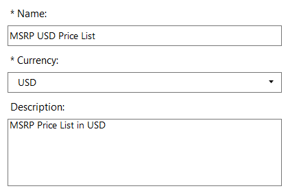
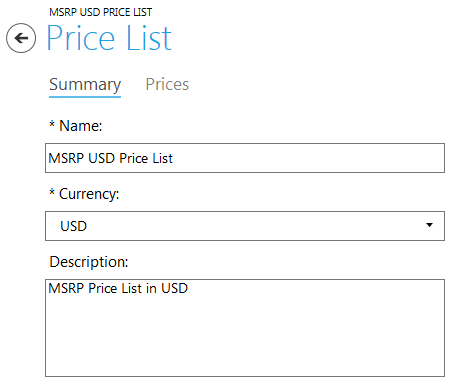
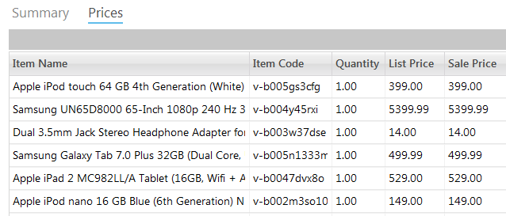
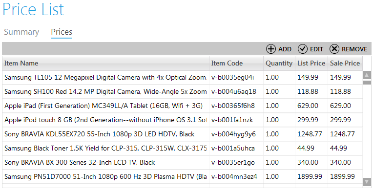
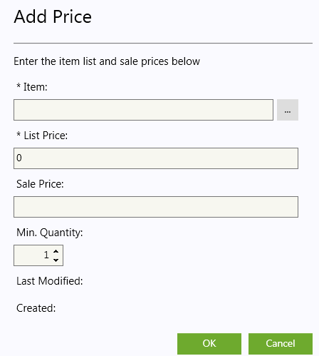
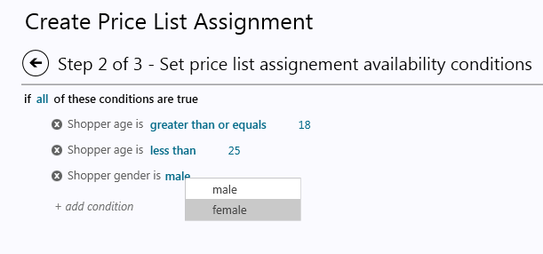

## はじめに

Virto Commerce マネージャーでは価格リストとは、商品と結びつける詳細な価格のセットになります。全ての価格は、カタログと通貨で組み合わされ価格リストとして保存されています。アイテム(SKU)コードは、カタログ配下の価格表内の価格にリンクします。また、直接表示するには、詳細項目の価格を設定することができます。お客様が店舗で商品を表示すると設定された価格が商品価格として表示されます。

価格リストは、"Price Lists" ブロックで管理されています。

## 価格リストの作成・削除

価格リストを作成するには、Price List ブロックの "Add" ボタンをクリックします。必須項目(Name, Currency)と説明分を入力します。

* **Name** - 価格リストの名前を入力
* **Currency** - 価格リストで使う通貨を指定。通貨ドロップダウンから一つを選択(システムで利用可能リストから)
* **Description** - 価格リストの概要と詳細を入力。例えば、製造元の希望小売価格(MSRP)リストが適用されます。

アイテムの価格は、価格リストの後に追加されています。

価格リストを削除するには、価格リストを選択し、"Remove" ボタンをクリックします。

## 価格リストの検索

登録済の価格リストが多くなった場合には、必要に応じて、右上隅にある "quick search" ツールを使用して検索することができます。より正確な検索ができるよう名前と通貨によるフィルタリングが右側に位置しています。

## 価格リストの表示

必要に応じて価格リストを表示するために、検索ツールを使用します。それは詳細ビューをダブルクリックして開きます。価格リストの詳細ダイアログには2つのタブがあります – 価格リストの概要情報を表示する "Summary" とアイテムの価格オプションが定義されている "Price" です。

Summary タブには、価格リストの名前・通貨(店舗の適用されている通貨オプション)・価格リストの説明が含まれています。Priceタブには、商品の価格のリストが表示されます。

プライス タブは、アイテムの価格のリストが表示されます。表には、商品名・コード・定義された価格・数量・販売価格が含まれています。

* **Item Name** - 価格が適用されるアイテムの名前
* **Item Code** - システムポリシーに沿ったコード(SKUコード)
* **Quantity** - 購入時に有効になる価格リスト商品の最少数量。全ての項目は、数量1以上の値を入力する必要があります。
* **List Price** - これは、殆どの場合、メーカー希望小売価格(MSRP)です。商品の唯一の価格表エントリーである場合には、この価格がデフォルトの価格になります。
* **Sale Price** - 必須ではありません。MSRPと違い、通常この価格はストアで表示された販売価格になります。

## 価格管理

価格リストをVirto Commerce Managerで作成した場合、価格リストに含んだアイテム定義が必要になります。それぞれの項目を定義する必要があります。価格表を開いて、"Prices" タブをアクティブにします。新しい価格表を作成する為に "Add" をクリックします。

続いて、次のダイアログを入力してください。

**Item** - カタログ内の既存アイテムからアイテムを選択します("…" ボタンを利用）。必要な項目を検索し、検索結果を選択し、"Choose" ボタンをクリックします。

* **List price** - 通常 MSRP(メーカー希望小売価格)です。商品の唯一の価格の場合、デフォルト価格になります。
* **Sale price** - ストアのアイテムの価格になります。
* **Min. Quantity** - 少なくとも "1" にする必要があります。アイテムを有効にするには、リスト・販売価格の最少数量を設定します。

更新するには、価格リストをダブルクリックします。

削除するには、価格リストから選択し、"Remove" ボタンをクリックします。

カタログから製品/SKUを削除する場合、全ての価格リストのエントリーは価格リストから削除されます。

## 価格リスト割り当ての管理

価格リストを作成する場合、特定のカテゴリーにリンクする為に、価格リストの割り当てを作成する必要があります。価格リストの割り当ては、製品の価格を顧客の為に表示し、価格リストを識別します。また、価格リストの割り当ては、デフォルトのリスト及び販売価格を提供するよりも多くのことを行うことができます。この機能を利用すると年齢・性別・地理的な位置・用語検索など、顧客の特性に応じてターゲット顧客にカスタム価格を提供することができます。

例えば、２つの異なる価格リストの割り当てを行うことができます。それぞれの価格は、年齢・顧客属性に基づいて異なる価格を提供できます。３５歳以上のお客様が、ラップトップの豪華なオプションを優先価格に設定しながら、エコノミークラスのラップトップで割引を受けることができます。

どのように動作しますか？価格リストのセットは、顧客に割り当てられています。例えば、価格リストAは、カタログ内の全ての製品の価格を持っており、全ての顧客に割り当てられています。価格リストBは、特定の製品向けに異なる価格を持っており(価格リストの割り当てで定義されています)特別な特性を顧客に割り当てています。価格リストBが、価格リストAよりも高い優先順位が設定されています。顧客が店舗に訪れると、システムは全ての価格リストの割り当て条件を評価することにより、価格リストの顧客セットを構築します。このセットによると、一部の顧客は価格リストAを含むセットを持っています。他の顧客は、価格リストAとBの両方を持っています。顧客が製品を表示すると、システムがセット価格リストを検索し、優先順位が最も高い価格リストからの価格が表示されます。価格リストには、そのアイテムの価格が含まれていない場合は、アイテムの価格が含まれている価格リストが見つかるまで、システムは価格リストの優先順位を下げます。

特定の価格リストが表示される条件を定義し決定する必要があります。

* 誰が価格リストにアクセスする権利を持つか(年齢・性別・場所など)
* いつ価格リストが有効になっているか（価格リストがアクティブになる日時)
* どこで価格リストが利用できるか(店舗に入店した際、店舗を離れる際)

価格リスト割り当てを作成する場合、"Price Lists" ブロックの "Price Lists Assignments" タブに移動し、"Add" ボタンをクリックします。

"Create Price List Assignment" ウィザードが表示されます。

最初のステップでは、以下の項目を入力します。

* **Name** - 価格リスト割り当ての名前を入力
* **Price List** - ドロップダウンから価格リストを選択。価格リストは、価格リスト割り当ての条件に該当するものが利用できます。
* **Catalog** - 価格表に利用されるカタログを選択
* **Priority** - 他の適用可能な価格リストの割り当てよりも優先するかどうかを定義
* **Description** - 価格リスト割り当ての概要・詳細な説明

ステップ２では、価格リストの割り当ての利用条件を定義する必要があります。新しい価格リスト割り当てに適用される条件を構築する為に "+add condition" ボタンをクリックします。例えば、18歳から25歳の女性の為の価格表を必要としているなど。この段階では、この価格リストにアクセスできる人を定義します。

ステップ３では、この価格リストが利用できるようになる定義を行います。新しい価格リスト割り当てが有効になる日付を定義する為に日付ピッカーを利用します。この項目未入力の場合、常に利用できるようになります。

価格リスト割り当ての編集を行う場合、割り当て一覧でダブルクリックし、修正を行います。

割り当てを削除する場合、割り当て一覧で選択後、Remove ボタンをクリックします。