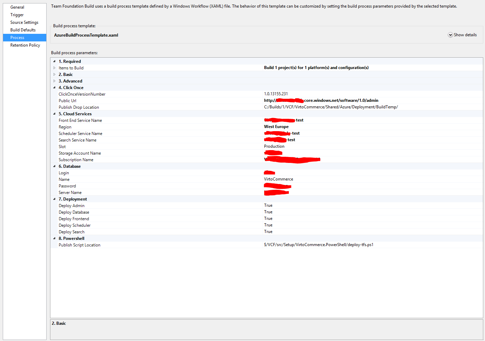

## Introduction

This document will provide introduction into Continuous Integration (CI) and Continuous Delivery (CD) practices. The main goal is improvement of quality and time it take to deliver solutions. Virto Commerce comes with tools, utilities, scripts and documentation to quickly setup both CI and CD in your organization. We also provide assistance if needed to help you with a process.

Typically to establish such environment you will need to have experts familiar with TFS Build infrastructure or outside consultants. Using traditional methods (in house or hosted Virtual Machines) it requires investment to be made to the hardware and some dedicated resources to manage it. With Azure platform and Virto Commerce you can configure such environments in a matter of minutes (it takes us around 15 minutes to configure the full environment) anywhere in the world. And there is almost none of the operational overhead, no one need to make sure servers are up to date on patches.

This document will explain how this can be done.

## Continuous Integration

This process will allow you to have an automate build that also runs all the custom tests to make sure the system is not degraded.

## Continuous Delivery

Setup automatic creating of testing, staging or production environments.

## Preparation

Follow the [Source Code Azure Deployment Guide](docs/old-versions/vc113devguide/development-environment/source-code-azure-deployment) to setup deployment on your Build Server. After you able to deploy manually using the powershell scripts, you can automate the process using the build infrastructure.

## Preparing TFS Build Server

Perform the following steps to configure TFS Build Server. This is a server that actually compiles the source code and uploads everything to azure. The configuration is similar to how developer workstation needs to be configured.

1. Install Java JRE7 runtime environment.
2. Configure deployment folder that contains all distribution files and deployment settings (included as part of the install package).
3. Create new build definition and select "AzureBuildProcessTemplate.xaml" as a process template.

## Running TFS Build

Configure parameters for your new build similar to the ones below.

