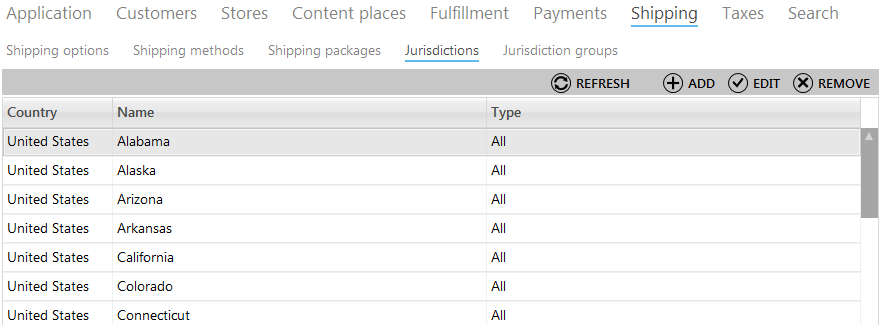

## はじめに

Virto Commerce Manager は、店舗の出荷ブロックの調整を行うことができます。今、ストアでの出荷方法、パッケージ方法、管轄と管轄グループなど定義を行う際には、開発者の支援を必要としません。出荷に関する設定全ては、Settings モジュールの "Shipping" タブ一か所で管理することができます。

## 出荷オプション

出荷 オプションタブは、Webストアーで利用できるオプションのリストを作成できるユーザーに許可され、それらにゲートウェイ適用の定義が可能です。

新しく出荷オプションを追加する際には、"Add"　ボタンを利用し、以下の項目を入力します。

* **Name** -  出荷オプションの名前を記述;
* **Gateway** - 出荷オプションで利用できるゲートウェイを選択;
* **Description** - 出荷オプションの説明を記述;
* **Available packages** - 出荷オプションで利用できるパッケージの定義(例として, small box や medium box).

出荷オプションを編集する際には、リストから選択し、"Edit" ボタンをクリックし、全ての必要な項目を編集します。出荷オプションを削除する際には、 同様の手順で、"Remove" ボタンをクリックします。

## 出荷方法

オンラインストアでの購入商品は、顧客に出荷されなければなりません。出荷は、ストアの特別な配送サービス・配達・他の方法で対応されなければなりません。これらの出荷方法は、Web ストアの利用可能なリストに含まれています。これは、Shipping settgings ブロックの "Shipping methods" タブで行うことができます。

This can be done in the "Shipping methods" tab of shipping settings block.

新しく出荷方法を追加するには、"Add"　ボタンをクリックし、以下の項目を入力します。

* **Name** - 出荷方法の名称を記述;
* **Description** - 出荷方法の概要及び詳細を記述;
* **Shipping option** - settings タブで事前に作成されたドロップダウンリストから選択;
* **Currency** - 出荷方法で利用できる通貨を指定;
* **Base price** - 出荷コスト・税抜き・割引などを含まない価格;
* **Is active** - ストアで選択可能な出荷方法としてする際には、チェックボックスを設定;
* **Available payments** - この出荷方法可能な支払方法を選択.
* **Languages** - 出荷の種類で適用可能なローカリゼーションを定義

出荷方法の編集を行うには、リストを選択し、"Edit" ボタンをクリックし、全ての項目を編集します。削除するには、同様の手順で、"Remove" ボタンをクリックします。

## 出荷パッケージ

"Shipping Packages" タブは、出荷方法の選択可能なパッケージオプションを調整するリストを含んでいます。これは、有効な様々なパッケージオプションを使い管理する許可があります。例えば、それは小包のために最適なパッケージを選択することでう。大きな箱で小さな製品を送信する機能を除外するのに役立ちます。

出荷パッケージを追加する際には、"Add" ボタンをクリックし、以下必要な項目を入力します。

* **Name** - パッケージの名前を記述します。例として、 "Small box"　など;
* **Description** - このパッケージの基本パラメータの説明を記述, 例として、重量制限とプロダクトタイプ;
* **Set Dimensions** - パッケージの幅、長さ、高さが必要な場合、チェックボックスを設定.

パッケージに変更が必要な場合、リストをクリックし、"Edit"ボタンをクリックします。同様のパッケージを削除するには、"Remove" ボタンをクリックします。

## 管轄

Shipping settings の "Jurisdictions" タブは、Web ストアの出荷管轄の調整を行います。

新しい管轄を追加するには、 "Add" ボタンをクリックし、以下の項目を入力します。

* **Code** - システムに適用可能な管轄のコード;
* **Name** -管轄の名前を記述;
* **Jurisdiction Type** - 管轄パラメーターで定義済のドロップダウンリストから選択;
* **City** - 管轄で適用されている市を指定(必須項目ではありません);
* **Country** - 管轄で提供される国を指定;
* **State, region** - 管轄て適用される地域を指定(必須項目ではありません);
* **County** - 管轄で適用される国を指定(必須項目ではありません);
* **District** - 管轄で適用される地区を指定(必須項目ではありません);
* **Zip Code Start and Zip Code End** - 管轄で適用される郵便番号;
* **Geo code** - 管轄で適用されるGEO コード.

管轄パラメーターを編集する場合には、管轄リストをクリックし、"Edit" ボタンをクリックします。管轄を削除するには、"Remove" ボタンをクリックします。

## 管轄グループ

時々、管轄ではなく、地域グループ・市で適用されることがあります。この場合、管轄グループに適用できます。Shipping settings の "Jurisdiction groups"　タブで調整することができます。

新しい管轄グループを追加する際には、"Add" ボタンをクリックし、以下の項目を入力します。

* **Code** - システムで適用される管轄のコード;
* **Name** - 管轄グループの説明を記述;
* **Jurisdiction Type** - 管轄の定義済パラメーター定義のドロップダウンリストから選択;
* **Available Jurisdictions** - 管轄のグループの組み合わせである管轄リストから選択.

管轄グループを変更する際には、リストから選択し、"Edit" ボタンをクリックします。削除する際には、同様の手順で、"Remove" ボタンをクリックします。