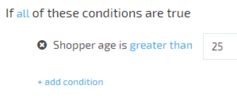
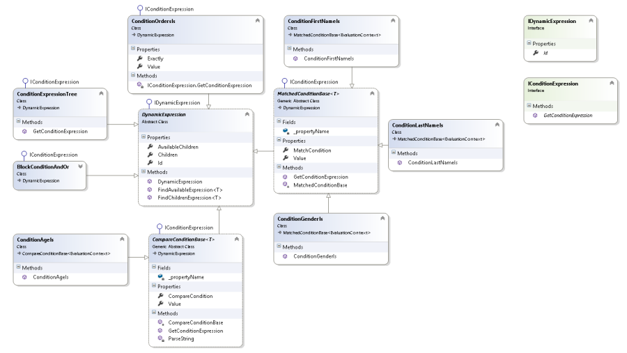
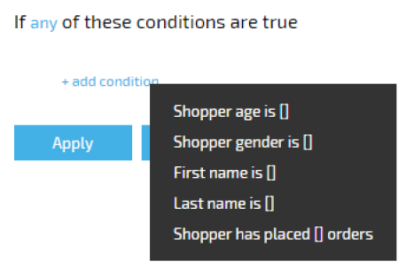
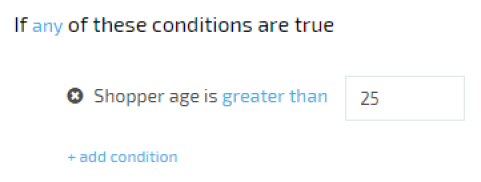

# Composing dynamic conditions

Composing dynamic conditions using .NET expression trees, ASP.NET and AngularJS

[Introduction](#h.h6fmwaoupd4u)  
[Brief solution review](#h.rnd2plpfngyi)  
[Condition classes and predicate builder](#h.1tze3fpcuaro)  
[Storing visual tree](#h.7fiswhc7qyki)  
[Evaluation context](#h.398pjygl1p3h)  
[Constructing visual tree using AngularJS](#h.ldnjkrkxxnt3)  
[Binding the condition tree to templates](#h.9qjo4t5p2y8u)  
[Expression evaluation](#h.bua3mdd19vyp)  
[Conclusion](#h.3656fecwuvwy)

# Introduction

Sometimes there is a need to give an end-user a way of composing conditions under which target objects should be filtered and returned to the client. For example, "*the product should be available to the shopper only if he is more than 25 years old*". Simplifying condition expressions building for the end-user is often a challenge.  
 The most common way to build condition expressions is by using a visual UI. That way the user builds the condition expression as a regular sentence. While reading a regular sentence it is easy to understand the specific circumstances the result will yield: object returned. In VirtoCommerce, we decided to implement this approach. Based on our experience gained developing 1.x version of VirtoCommerce that is implemented using WPF we decided to migrate conditions composing functionality from there. .NET Expressions fits well to filter objects and save the filter as they are serializable. For showing conditions to a user we used AngularJS as the platform uses it. So, our solution is to compose conditions using lambda expression tree and angularjs, to show the conditions to the end-user.

  
 Example:  
 "Show banner if *all* of the conditions are true: *shopper age is greater than 25*"  
  
 In the example above, ***all*** and ***shopper age is greater than 25*** each constitute a predicate. The result of executing the predicate will be showing or not showing the banner on the page depending on the shopper's provided birth date or age.   
 Such a sentence is understandable even for those not familiar with programming.   
 Another advantage of this approach is that it minimizes errors while building conditions. The user chooses conditions from those already available and condition values are restricted by the type of the condition.  
 The task is to convert condition sentences such as these into a correct predicate expression to evaluate it and save the visual presentation of the expression in order to restore the view for later view/edit.

# Brief solution review

In VirtoCommerce every condition is a class. Each of the condition classes must have the following functionality:

* It must have a method that returns the lambda expression which returns a boolean value based on the provided context parameter. You can read more about expressions on the [msdn programming guide](https://msdn.microsoft.com/en-us/library/bb397687.aspx). That way it's possible to get linq expression of the condition to evaluate it later.
* It must provide properties to show and edit configurable condition parameters. That way we give the end-user a way enter condition values for comparing with the context passed values.
* It must have array property of current children conditions. If the condition can have nested conditions they will be saved here.
* It must have array property of possible children conditions. If the condition can have nested children we should give an end-user a way to add them from the array of available nested conditions. Those conditions are saved here.
* The condition class must be serializable/deserializable. In order to save and restore the conditions tree there is a need to serialize/deserialize the condition.
* Condition can be showed/edited using AngularJS. The end-user should be able to view and edit the conditions.

  
 In next chapters we will walk through the tasks in details.

# Condition classes and predicate builder

A condition class must have a method that returns lambda expression based on passed context of interface IEvaluationContext. Thus all conditions will be executed on the same context when the lambda expression tree will be composed. A condition class must implement the IConditionExpression interface which declares the only method. The method must return the lambda expression.

```
public interface IConditionExpression
{
	System.Linq.Expressions.Expression<Func<IEvaluationContext, bool>> GetConditionExpression();
} 
```

  
 This means that each condition class is obliged to have a method which returns the expression to be added to the conditions tree.  
 Each condition can have an array of nested conditions to save included conditions and an array of available children conditions those are the conditions that can be added to it. AngularJS uses this the later property to show conditions that can be added to the end-user. For that purpose we implemented the base abstract class DynamicExpression that defines appropriate properties. Every condition must be derived from the DynamicExpression.

```
public abstract class DynamicExpression : IDynamicExpression
{
	public DynamicExpression()
	{
		Id = this.GetType().Name;
		AvailableChildren = new List<DynamicExpression>();
		Children = new List<DynamicExpression>();
	} 
	#region IDynamicExpression Members 
	public string Id { get; set; } 
	#endregion
	[JsonProperty(ItemTypeNameHandling = TypeNameHandling.All)]
	public ICollection<DynamicExpression> AvailableChildren { get; set; }
 
	[JsonProperty(ItemTypeNameHandling = TypeNameHandling.All)]
	public ICollection<DynamicExpression> Children { get; set; } 
	public T FindAvailableExpression<T>() where T : IDynamicExpression
	{
		var retVal = this.Traverse(x => x.AvailableChildren).SelectMany(x => x.AvailableChildren).OfType<T>().FirstOrDefault();
		return retVal;
	}
	public T FindChildrenExpression<T>() where T : IDynamicExpression
	{
		var retVal = this.Traverse(x => x.Children).SelectMany(x => x.Children).OfType<T>().FirstOrDefault();
		return retVal;
	}
} 
```

  
 Note the JsonProperty attribute where we set to serialize the namespace with the name of the property - ItemTypeNameHandling = TypeNameHandling.All. This is required to store the UI tree of conditions but we'll discuss that in greater detail later.   
 The next task is to collect expressions from all the conditions and compose them into the lambda expression tree.  
 We use the PredicateBuilder class that allows you to compose dynamic lambda expression trees.   
**Note:** More on PredicateBuilder read: [http://www.albahari.com/nutshell/predicatebuilder.aspx](http://www.albahari.com/nutshell/predicatebuilder.aspx)  
 The root element of the conditions tree must also be the class that implements IConditionExpression interface. Let's call the root class - ConditionExpressionTree. All conditions created by the end-user will be children of the particular root object. The implementation of the GetConditionExpression method in the root class must walk through all of its children elements, get their lambda expressions while adding them to the root lambda expression. Cue the PredicateBuilder.

```
public virtual System.Linq.Expressions.Expression<Func<IEvaluationContext, bool>> GetConditionExpression()
{
	var retVal = PredicateBuilder.True<IEvaluationContext>();
	foreach (var expression in Children.OfType<IConditionExpression>().Select(x => x.GetConditionExpression()).Where(x => x != null))
	{
		retVal = retVal.And(expression);
	}
	return retVal;
} 
```

  
 The result of the above method is the lambda expression tree. Next step is serialize the expression tree to store it in the repository for later deserialization and evaluation.   
 The class diagram shows the classes and associations  


# Storing visual tree

In order to show and edit the conditions later to the client, there is also a need to store visual part of the conditions tree. As already mentioned above, every condition has Сhildren and AvailableChildren properties. Each property has a JSON attribute. That way conditions with the properties are serialized into JSON to be stored in a repository using JsonConvert from Newtonsoft.Json library. The client-side ***null***s some properties (such as *AvailableChildren* property) to reduce the condition object size.

```
function stripOffUiInformation(expressionElement) {
	expressionElement.AvailableChildren = undefined;
	expressionElement.displayName = undefined;
	expressionElement.getValidationError = undefined;
	expressionElement.groupName = undefined;
	expressionElement.newChildLabel = undefined;
	expressionElement.templateURL = undefined; 
	_.each(expressionElement.Children, stripOffUiInformation);
}; 
```

  
 Those properties are not required to save and restore the condition tree view.  
 The condition can be restored and passed to the client on demand. For that purpose the serialized object must be deserialized, filled with missing properties (such as *AvailableChildren* property) from the etalon condition object and passed to the client to view it using angularjs script.   
 Serialized conditions tree example:

```
{
	"Id":"ConditionExpressionTree",
	"AvailableChildren":null,
	"Children":[{
		"$type":"ConditionExpressionsDemo.Conditions.BlockConditionAndOr, ConditionExpressionsDemo",
		"All":false,
		"Id":"BlockConditionAndOr",
		"AvailableChildren":null,
		"Children":[
		{
			"$type":"ConditionExpressionsDemo.Conditions.ConditionAgeIs, ConditionExpressionsDemo",
			"Value":25,
			"CompareCondition":"IsGreaterThan",
			"Id":"ConditionAgeIs",
			"AvailableChildren":null,
			"Children":[]
		}]
	}]
} 
```

  
 Note the Id property. It's required to distinguish the condition class among others and match it with the etalon condition class to fill the missing ***null***ed properties (such as *AvailableChildren* property).   
 Having the serialized lambda expression tree and JSON serialized visual tree, we store them in PredicateSerialized and VisualTreeSerialized properties of the target Condition object.

# Evaluation context

In order to execute the lambda expression tree, the context must be passed. In previous chapters you could note that all the conditions must get the context of IExpressionContext interface. That's the context with the properties that the expression conditions expect to be matched with. The implementation of the interface can have predefined properties as well as an extensible dictionary of objects.

```
public class EvaluationContext : IEvaluationContext
{
	public EvaluationContext()
	{
		Attributes = new Dictionary<string, string>();
	} 
	public object ContextObject { get; set; }
	protected IDictionary<string, string> Attributes { get; set; }
	...
	public int CustomerAge{ get; set; }
} 
```

  
 The Context can be extended with properties according to your needs.

# Constructing visual tree using AngularJS

We use angularjs to show and edit the conditions tree.   
 First, create a factory that stores the condition templates. That's the place where extended properties for all conditions required by UI will be saved.

```
.factory('virtoCommerce.coreModule.common.dynamicExpressionService', function () {
	var retVal = {
		expressions: [],
		registerExpression: function (expression) {
			if (!expression.templateURL) {
				expression.templateURL = 'expression-' + expression.id + '.html';
			} 
			this.expressions[expression.id] = expression;
		}
	};
	return retVal;
}) 
```

  
 Next create the html template for the condition.

```
<script type="text/ng-template" id="expression-ConditionAgeIs.html">
	Shopper age is
	<a class="__link" left-click-menu data-target="compareCondition_menu{{element1.id}}">element1.compareCondition | compareConditionToText</a>
	<div class="form-input __mini __number">
		<input smart-float num-type="integer" required ng-model="element1.value">
	</div>
	<ul class="menu __context" role="menu" id="compareCondition_menu{{element1.id}}">
		<li class="menu-item" ng-click='element1.compareCondition="IsMatching";'>matching</li>
		...
		<li class="menu-item" ng-click='element1.compareCondition="IsLessThanOrEqual";'>less than or equals</li>
	</ul>
</script> 
```

  
 Note that if the *id* of the script matches the template defined in the factory   
 expression-' + expression.id + '.html   
 then there is no need to provide templateURL explicitly while registering it in dynamicExpressionService. expression.id - is the condition class name (*ConditionAgeIs* in the sample above). Other than that, the script is an html template of the condition that uses the JSON serialized condition visual tree data to show it to the user.   
 Next, register the expression extended properties in the factory

```
dynamicExpressionService.registerExpression({
	templateURL: 'expression-ConditionAgeIs.html',
	id: 'ConditionAgeIs',
	displayName: 'Shopper age is []'
});
```

* DisplayName is a condition description at the time when the user is selecting a condition to add. A new condition is added by selecting it from a context menu.
* Id is the class name of the condition.
* TemplateURL is the id of the template to apply when the condition is rendered in the UI. A default value is constructed as 'expression-' + expression.id + '.html' if the parameter is omitted.
* NewChildLabel is the label text for items that can have children (AvailableChildren is not *null*). If no child conditions can be added to the particular condition the NewChildLabel can be omitted.

## Binding the condition tree to templates

When the client-side gets a response from the server with the condition expression tree it must bind the appropriate template with every condition in the tree to show the condition and available nested conditions in the context menu properly. For that purpose we use *extendElementBlock* function. It also extends conditions with the properties defined in the *dynamicExpressionService* that is required in UI. The function is called recursively on each child and available child condition. The conditions and *dynamicExpressionService* registered expressions are matched by the id property that way conditions are filled with the missing properties required to show it to the user.

```
function extendElementBlock(expressionBlock) {
	var retVal = dynamicExpressionService.expressions[expressionBlock.id];
	if (!retVal) {
		retVal = { displayName: 'unknown element: ' + expressionBlock.id };
	} 
	_.extend(expressionBlock, retVal); 
	if (!expressionBlock.children) {
		expressionBlock.children = [];
	} 
	_.each(expressionBlock.children, extendElementBlock);
	_.each(expressionBlock.availableChildren, extendElementBlock);
	return expressionBlock;
} 
```

  
 If condition with the id not found, the default template provided: displayName: 'unknown element: ' + expressionBlock.id  
 The previously registered context menu item is presented in the conditions menu like on the screenshot below.  
  
 Each condition is rendered in the dynamic expression tree using the template specified by *templateURL*. Our previous example appears below:   


# Expression evaluation

When the client requests objects the context should be provided. The expression evaluator deserializes the saved conditions lambda expression tree and evaluates it on the provided context.   
 First get the deserialized predicate:

```
//deserealize dynamic condition
var condition = SerializationUtil.DeserializeExpression<Func<IEvaluationContext, bool>>(PredicateSerialized); 
```

 

Next, pass the context to the deserialized predicate.

```
var result = condition(context); 
```

  
 Depending on the ***result*** the object is returned to the client or it is not.

# Conclusion

In this article we showed the approach of building condition expressions using lambda expressions and the predicate builder to construct the conditions tree. Serialize it using ExpressionSerialization library and JsonConvert for storing. Deserialize it for evaluation and evaluate the lambda expression tree on a provided context to decide if the object should be returned to the client. Linq expressions allows easily to construct and evaluate condition tree logic.  
 Another part is to show the conditions to the user in a user-friendly way. For that purpose we used angularJS. It uses html templates for each condition and a JSON-serialized condition data to show property values of the condition. AngularJS allows easily to create templates for the conditions and construct the visually attractive conditions sentence.


