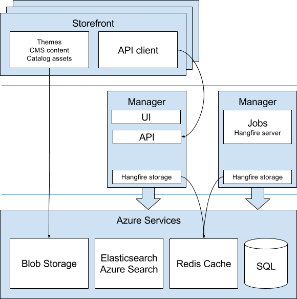

# Virto Commerce network configuration with web farm and Microsoft Azure cloud services

## Scheme

## Resources

Create the following Azure resources:

* Web Apps:  * Storefront (multiple instances)
  * Manager (API, UI)
  * Manager (background jobs)

* Other resources:  * Blob storage
  * Elasticsearch or Azure Search
  * Redis cache
  * SQL database

## Details

### Storefront

The storefront application is separated from the manager application.  
 Storefront can be scaled to multiple instances.  
 Each storefront instance has its own local cache and a shared Redis cache, which besides synchronization can reduce the cold start time.

### Virto Commerce Manager

The manager application is split into two web apps: first one provides API and UI and second one runs background jobs.  
 Both manager web apps use shared Redis cache as Hangfire storage. First web app does not run Hangfire server, it just uses Hangfire storage to create jobs and track its status.

### Blob storage

Blob storage is used for storing themes, CMS content and catalog assets.

### Redis cache

Redis cache is used as Hangfire storage and as a distributed cache for multiple storefront instances.

