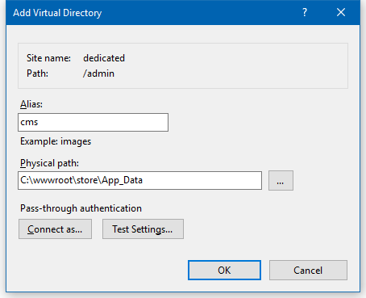
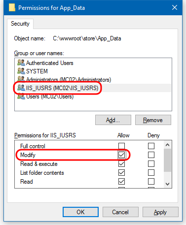

## Actions on local machine

### Prerequisites

* Microsoft .NET Framework 4.5.1
* <a href="https://nodejs.org/" rel="nofollow">Node.js</a>

### Get source code

Download source code from GitHub repository <a href="https://github.com/VirtoCommerce/vc-community/tree/master" rel="nofollow">https://github.com/VirtoCommerce/vc-community/tree/master</a> by clicking the **Download ZIP** button.

Extract all files.

### Compile solution

Run **deploy.cmd**

This command will compile the solution and put **admin** and **store** applications to the **artifacts\wwwroot** folder.

### Upload files to the web server

Upload **wwwroot** folder to the web server.

## Actions on web server

### Prerequisites

* Windows Server 2008 or later (IIS 7 or later)
* Microsoft .NET Framework 4.5.1
* <a href="https://www.microsoft.com/en-us/download/details.aspx?id=40784" rel="nofollow">Visual C++ Redistributable Packages for Visual Studio</a> (for storefront)
* Microsoft SQL Server 2008 or later

## Setup Virto Commerce Manager application

### Configure connection strings

* Open the **wwwroot\admin\Web.config** file in a text editor.
* In the **connectionStrings** section change the following connection strings:
  * **VirtoCommerce**: parameters for  SQL server database. Provided user should have permission to create new database.
  * **SearchConnectionString**: type of search engine and its parameters.
  * **AssetsConnectionString**: type of asset storage and its parameters.
  * **CmsContentConnectionString**: type of CMS content storage and its parameters. Change the **rootPath** value to **..\store\App_Data**:
  ```
  <add name="CmsContentConnectionString" connectionString="provider=LocalStorage;**rootPath=..\store\App_Data**;publicUrl=http://localhost/admin/cms" />
  ```

### Configure permissions for App_Data folder

Open properties for **wwwroot\admin\App_Data** folder and give permission **Modify** to **IIS_IUSRS** user group.


### Configure IIS

* Open the **IIS Manager** and create a new website or new application named **admin** inside an existing website.
* In the **Physical path** field enter the full path to the **wwwroot\admin** folder.
* Select application pool which uses **.NET CLR Version 4.0** and **Integrated** pipeline mode:

* Inside the admin application add the new virtual directory with alias **assets** and physical path **admin\App_Data\Assets**. If there is no Assets directory inside App_Data, create it:

* Inside the admin application add one more virtual directory with alias **cms** and physical path **store\App_Data**:

* Open the Virto Commerce Manager application in the browser.
* On the first request the application will create and initialize database. After that you should see the sign in page. Use the following credentials:
  * Login: **admin**
  * Password: **store**

### Change administrator password

* In the left menu select **Configuration > Security**.
* Select **Users**
* Select the **admin** user.
* Click **Change password**.
* Enter the new password twice and click **OK**.

### Change API credentials for storefront application

* In the left menu select **Configuration > Security**.
* Select **Users**
* Select the **frontend** user.
* Click the **API Keys** widget.
* Select the **Frontend Hmac** key
* Click **Generate**, then **OK**, then **Save**.

## Setup Storefront application

### Configure web API base URL

* Open the **wwwroot\store\Web.config** in a text editor.
* In the **connectionStrings** section find the **add** node named **VirtoCommerce BaseUrl**. Change its **connectionString** attribute value to the URL of your **Commerce Manager** application.

### Configure web API credentials

* Open the **wwwroot\store\Web.config** in a text editor.
* In the **appSettings** section find the **add** nodes named **vc-public-ApiAppId** and **vc-public-ApiSecretKey** and change its values to values generated in **Virto Commerce Manager** application.

### Configure permissions for App_Data folder

Open properties for **wwwroot\store\App_Data** folder and give permission **Modify** to **IIS_IUSRS** user group:



### Configure IIS

* Open the **IIS Manager** and create a new website or new application inside an existing website.
* In the **Physical path** field enter the full path to the **wwwroot\store** folder:

* Select application pool which uses **.NET CLR Version 4.0** and **Integrated** pipeline mode:

* Open the storefront application in the browser.