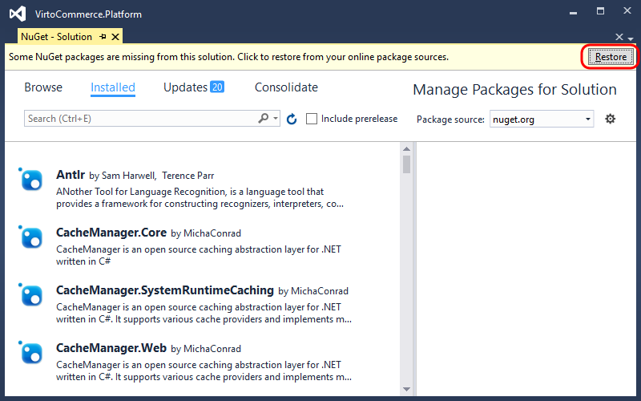
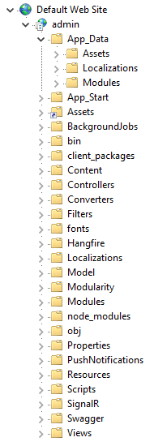
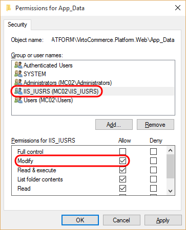
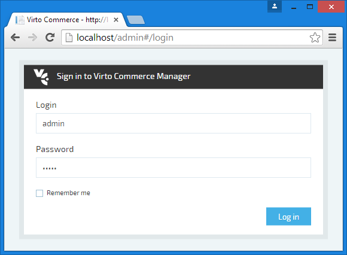

## Summary

Use this guide to obtain source code and setup development environment.

## Prerequisites

* Microsoft .NET Framework 4.5.1
* Internet Information Services 7 or later
* Microsoft SQL Server 2008 or later (*Express or Full*)
* Visual Studio 2013 or later (*optional*)

## Get platform from GitHub
The platform can be installed in two ways as **binary precompilled** version or from **source code**.

### Downloading the precomplied version .zip File:
Navigate to the  <a href="https://github.com/VirtoCommerce/vc-platform/releases" rel="nofollow">Releases Section of Virto Commerce in GitHub.</a>

You will find VirtoCommerce.Platform.2.x.x.zip file. In this file the site has already been built and can be run without additional compilation. It does not includes all the source code.

Unpack follow zip to local disk to path '**c:\vc-platform-master**'. In result you should get '**c:\vc-platform-master\VirtoCommerce.Platform.Web**' folder which contains platform precompiled code.

### Download and build platfrom from source code

Download the latest source code from GitHub repository <a href="https://github.com/VirtoCommerce/vc-platform" rel="nofollow">https://github.com/VirtoCommerce/vc-platform</a> by clicking the **Download ZIP** button.Extract all files.

Open **VirtoCommerce.Platform.sln** solution.In Solution Explorer window right-click on solution and select **Manage NuGet Packages for Solution**. In the opened window click the **Restore** button.
Build the solution.


## Configure SQL Server

SQL Server Authentication mode must be enabled.  
 

Create the new login named **virto** with password **virto**. The password policy enforcement should be switched off for a simple password like this.

```
USE master; CREATE LOGIN virto WITH PASSWORD = 'virto', CHECK_POLICY = OFF
```

Give the **CREATE ANY DATABASE** permission to user virto. This will allow you to create a database automatically when Commerce Manager starts. For new databases created with this permission the user will have the **db_owner** role while access will be denied for any other database.

```
USE master; GRANT CREATE ANY DATABASE TO virto
```

Open the **C:\vc-platform-master\VirtoCommerce.Platform.Web\web.config** file and make sure the **VirtoCommerce** connection string has correct parameters for your configuration, particularly **Data Source** (SQL Server address), **Initial Catalog** (database name), **User ID** (user name) and **Password**.

## Configure IIS

Open **IIS Manager** and add new application to **Default Web Site** with alias **admin** and physical path to **C:\vc-platform-master\VirtoCommerce.Platform.Web**. Select application pool which uses **.NET CLR Version 4.0** and **Integrated pipeline mode**.


Inside the **admin** application add a new virtual directory with alias **Assets** and physical path to **VirtoCommerce.Platform.Web\App_Data\Assets**. If there is no Assets directory inside App_Data, create it.


Your web site structure should be similar to the one shown below:


## Configure file system

Open properties for the folder where you have extracted  precompiled version or source code  (vc-platform-master by default) and give permission **Read & execute** to **Users** group if this permission is not inherited from the parent folder.  


Open properties for **C:\vc-platform-master\VirtoCommerce.Platform.Web\App_Data** folder and give permission **Modify** to **IIS_IUSRS** user group.


Open properties for **C:\vc-platform-master\VirtoCommerce.Platform.Web\Modules** (create this folder if not exsist) folder and give permission **Modify** to **IIS_IUSRS** user group as shown above.

## Start Commerce Manager

Open the **http://localhost/admin** URL in browser. A sign in page should open:


The default administrator account login is **admin** and the password is **store**.

## Next steps (optional)

The VC platform is up and running. What's next? Here are some ideas to try.

### Install modules in VC Manager app

Install some modules as described in [Modules management](docs/vc2userguide/configuration/modules-management) tutorial.

### Manual **module installation** from source code

Do you prefer the installation in **dev**eloper way? Great, follow these steps for each module:
* Download the latest module source code from GitHub repository **https://github.com/VirtoCommerce/vc-module-module_name** by clicking the **Download ZIP** button.
* Extract it to platform's **Modules** directory. You also can extract it to any directory and link it to the Modules directory using **mklink /d** command.
* Open and compile module solution.
* Restart IIS.
* Open Manager app.
* The new module will be installed automatically.
* Check its status in **Configuration** > **Modules** > **Installed**.

### Create your own module

Why not to **create your own** module? Follow the steps described in [Developing a custom solution](docs/vc2devguide/development-scenarios/developing-a-custom-solution) tutorial.

### How platform loads modules

