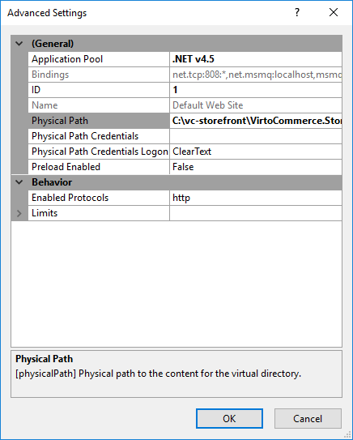

---
aliases:
  - docs/vc2devguide/deployment/storefront-deployment/storefront-source-code-getting-started
date: '2017-08-31'
layout: docs
title: 'Deploy Storefront from source code'

---
## Summary

Use this guide to deploy and configure Virto Commerce Storefront from source code and setup development environment.

## Prerequisites

* Microsoft .NET Framework 4.6.1
* Internet Information Services 7 or later
* <a href="https://www.microsoft.com/en-us/download/details.aspx?id=40784" rel="nofollow">Visual C++ Redistributable Packages for Visual Studio</a>
* Visual Studio 2015 or later (*optional*)
* Git

## Downloading source code

Fork your own copy of VirtoCommerce Storefront to your account on GitHub:
1. Open <a href="https://github.com/VirtoCommerce/vc-storefront" rel="nofollow">VirtoCommerce Storefront in GitHub</a> and click **Fork** in the upper right corner.
2. If you are a member of an organization on GitHub, select the target for the fork.
3. Clone the forked repository to local machine:
  ```
  git clone https://github.com/<<your GitHub user name>>/vc-storefront.git C:\vc-storefront
  ```
4. Switch to the cloned directory:
  ```
  cd C:\vc-storefront
  ```
5. Add a reference to the original repository:
  ```
  git remote add upstream https://github.com/VirtoCommerce/vc-storefront.git
  ```
In result you should get the **C:\vc-storefront** folder which contains full storefront source code.
To retrieve changes from original Virto Commerce Storefront repository, merge **upstream/master** branch.

Restore NuGet packages in one of the following ways:
* Open **VirtoCommerce.Storefront.sln** solution in Visual Studio. In Solution Explorer window right-click on solution and select **Manage NuGet Packages for Solution**. In the opened window click the **Restore** button.

* Run this command:
   ```
   nuget restore C:\vc-storefront\VirtoCommerce.Storefront\VirtoCommerce.Storefront.sln
   ```
Build the solution.

## Configuring VirtoCommerce Platform URL

* In the **C:\vc-storefront\VirtoCommerce.Storefront\web.config** file in the **connectionStrings** section find the **add** node named **VirtoCommerceBaseUrl**.
* Change its **connectionString** attribute value to the URL of your **VirtoCommerce Platform** application.

  ```
  <connectionStrings>
    ...
    <add name="VirtoCommerceBaseUrl" connectionString="{VirtoCommerce Platform URL}" />
    ...
  </connectionStrings>
  ```

## Configuring API client credentials

VirtoCommerce Platform supports 2 types of authentication for API calls:

* Simple - when user id is passed in url for each API request, e.g. http://demo.virtocommerce.com/admin/api/catalog/catalogs?api_key=a348fa7508d342f6a32f8bf6c6681a2a%20
* HMAC - Hash-based message authentication code (HMAC) is used to identify a client and ensure the request integrity.

In order to enable Storefront app using VirtoCommerce Platform API, first of all create a user in VirtoCommerce Platform and generate API key of appropriate type (Simple or HMAC). Article [Working with platform API](docs/vc2devguide/development-scenarios/working-with-platform-api) describes how to configure and use API in your custom solution. Then set API client credentials in **C:\vc-storefront\VirtoCommerce.Storefront\web.config**

### Example of HMAC authentication configuration

```
<appSettings>
  ...
  <add key="vc-public-ApiAppId" value="27e0d789f12641049bd0e939185b4fd2" />
  <add key="vc-public-ApiSecretKey" value="34f0a3c12c9dbb59b63b5fece955b7b2b9a3b20f84370cba1524dd5c53503a2e2cb733536ecf7ea1e77319a47084a3a2c9d94d36069a432ecc73b72aeba6ea78" />
  ...
</appSettings>
```

### Example of Simple authentication configuration

```
<appSettings>
  ...
  <add key="vc-public-ApiAppId" value="a348fa7508d342f6a32f8bf6c6681a2a" />
  ...
</appSettings>
```

## Configure CMS content storage

You can configure CMS content storage path in one of the following ways:
* Create a link to VirtoCommerce Platform **cms-content** folder:
  ```
  mklink /d C:\vc-storefront\VirtoCommerce.Storefront\App_Data\cms-content C:\vc-platform\VirtoCommerce.Platform.Web\App_Data\cms-content
  ```
* Change CMS content connection string:
  * In the **C:\vc-storefront\VirtoCommerce.Storefront\web.config** file in the **connectionStrings** section find the **add** node named **ContentConnectionString**
  * Change its **connectionString** attribute value to the path of folder specified in **CmsContentConnectionString** connection string in your VirtoCommerce Platform installation (**~/App_Data/cms-content** by default, i.e. you must use **provider=LocalStorage;rootPath=C:\vc-platform\VirtoCommerce.Platform.Web\App_Data\cms-content** connection string in this case)
  ```
  <connectionStrings>
    ...
    <add name="ContentConnectionString" connectionString="provider={provider name};rootPath={URL to CMS content location}" />
    ...
  </connectionStrings>
  ```

## Configure themes

If you did not install sample data for your platform, you need to configure theme for you storefront stores.
To upload theme in VirtoCommerce Platform UI, follow this steps:
1. Download zip file from latest release of [any storefront theme](apps/themes).
2. Go to [VirtoCommerce CMS Content module](apps/extensions/virto-cms-module) in VirtoCommerce Platform UI (**More → Content**).
3. Open **Themes** widget for your store.
4. Click to **Upload** button and select downloaded zip file.

If you want to develop storefront theme, follow [theme development documentation](docs/vc2devguide/working-with-storefront/theme-development) to learn how to setup theme for your store in theme development environment.

## Configure IIS (optionally)

Open **IIS Manager** and change physical path of **Default Web Site** to **C:\vc-storefront\VirtoCommerce.Storefront**. Select application pool which uses **.NET CLR Version 4.0** and **Integrated pipeline mode**.


## Start VirtoCommerce Storefront

Right click on **VirtoCommerce.Storefront** project and select **View → View in Browser** or right click on **Default Web Site** and select **Manage Website → Browse**. The store home page should open.
