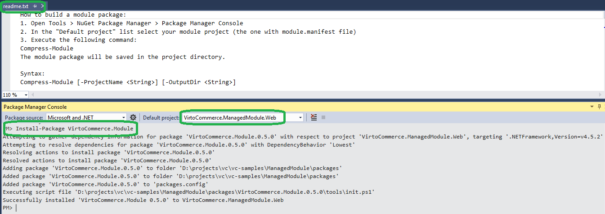

## Overview

Module package is a distributable piece of software that can be installed in VirtoCommerce Platform. Technically, module package is a ZIP archive containing module manifest and other module content:

Modules can be unmanaged (JavaScript only) or managed (containing .NET assemblies).

## Create an unmanaged module package

For pure JavaScript modules you can use your favorite ZIP archiver: navigate to the folder containing *module.manifest* and archive all the necessary files / folders.

## Create a managed module package

Managed modules should be created by using a special Powershell command in Visual Studio (VS).

## Preparing the project

The following steps are needed only once per module. Skip this paragraph if your module has the reference to VirtoCommerce.Module library.

* Open Package Manager Console in VS having your new module project loaded (Tools -> NuGet Package Manager -> Package Manager Console);
* In the "Default project" list select the module project (the one with module.manifest file);
* Install VirtoCommerce.Module package (execute command: Install-Package VirtoCommerce.Module). More info on the package: <a href="https://www.nuget.org/packages/VirtoCommerce.Module" rel="nofollow">https://www.nuget.org/packages/VirtoCommerce.Module</a>
* readme.txt is displayed after the package installation is completed.

The module is ready to be build as a package.

## Building the module package

Execute these steps every time when you need the module package to be created / updated:

Open and build the module project in VS;If need, update the module version (in module.manifest) and build again;Open Package Manager Console (Tools -> NuGet Package Manager -> Package Manager Console);In the "Default project" list select the module project (the one with module.manifest file);Execute command: Compress-Module

The module package is created in the project directory.