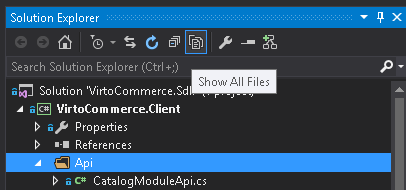

This document describes how to setup the environment, build and update an API C# client for Virto Commerce platform module.

## Preparing building environment and AutoRest

**The next steps are required only if you're building the API client for the first time.**

* Open the C# project where the API client is needed using Visual Studio.
* Install AutoRest package using nuget. Note: AutoRest **ver. 0.17.0 or higher** is required, as some critical fixes were applied only on August 18th, 2016. Get a nightly build as described in <a href="https://github.com/Azure/autorest" rel="nofollow">autorest README</a>, if ver. 0.17.0 would be still unreleased on nuget.
* Restart Visual Studio. (This enables AutoRest environment to be loaded correctly).

As a result you will have the environment ready to build the API client.

## Generating API client

* Get the latest API source code (module).
* Rebuild the module in order to update API.
* Open the project where the API client is needed.
* Open Package Manager Console (Tools > NuGet Package Manager > Package Manager Console). Generate required API clients using AutoRest.exe tool. Example of command generating VirtoCommerce Catalog module API client in <a href="https://github.com/VirtoCommerce/vc-storefront" rel="nofollow">Storefront SDK</a>:

```
AutoRest.exe -Input http://localhost/admin/docs/VirtoCommerce.Catalog/v1 -OutputFileName CatalogModuleApi.cs -Namespace VirtoCommerce.Storefront.AutoRestClients.CatalogModuleApi -ClientName CatalogModuleApiClient -OutputDirectory VirtoCommerce.Storefront\AutoRestClients -AddCredentials true -UseDateTimeOffset false
```

* Include the generated *.cs file to the project (Ensure that “Show All Files” option is activated to be able to locate the file):
  
* Build the solution.

## Updating API client

API client update involves the same steps as listed in the previous chapter, just without the need to include the generated files to project.