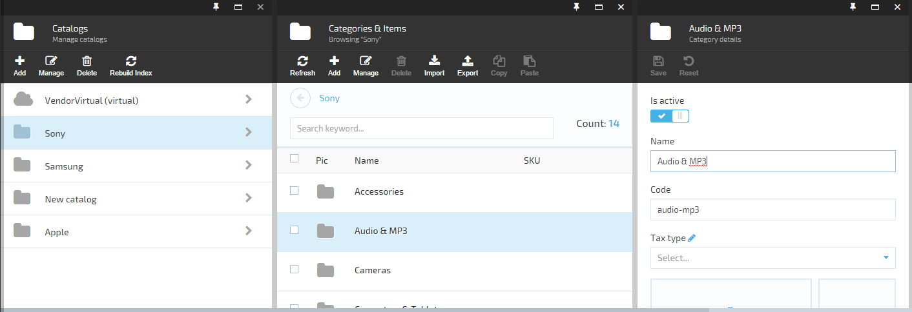

---
title: Blades and navigation
description: The article describes blades and navigation in Virto Commerce
layout: docs
date: 2015-08-14T19:15:52.217Z
priority: 2
---
## Overview

UI is organized and divided into panels called blades. Blades are ordered from left to right on the screen and have parent-child relations. Parent blade possesses a collection of children blades and every child has a reference to it's parent. The hierarchy depth is unlimited.



3 blades: parent and a child blade having another child.

## Blade structure and properties

Every blade is instantiated from a highly customizable template. The template has basic parts such as Maximize, Close buttons on the top and the title, toolbar, main content placeholders following down. We've created a "Blade constructor" page demonstrating all the customization possibilities and allowing to "construct a blade on the fly". Despite the completeness, "Blade constructor" is a useful resource for quick reference too. Check it out at [https://virtocommerce.com/styleguide/blade-constructor.html](https://virtocommerce.com/styleguide/blade-constructor.html).

The blade object has the following properties that VirtoCommerce platform respects:

|Property|Type|Description|
|--------|----|-----------|
|id|string|blade identifier. Required and should be unique in module level.|
|isLoading|bool|value indicating that loading indicator should be displayed in UI.|
|headIcon|string|icon to show on the blade header. A [Font Awesome](http://fontawesome.github.io/Font-Awesome/icons/) icon identifier. A default icon 'fa-folder' is used if value undefined.|
|title|string|blade title|
|subtitle|string|blade subtitle|
|toolbarCommands|object []|toolbar commands. Check [Blade toolbar documentation](docs/vc2devguide/working-with-platform-manager/basic-functions/blade-toolbar) for details.|
|controller|string|angularJS controller id. Required.|
|template|string|angularJS template path. Required.|
|parentBlade|object|reference to parent blade. Platform sets the value automatically.|
|childrenBlades|object []|children blades. Platform sets and manages the value automatically.|
|isClosingDisabled|bool|value indicating that the close botton (x) should be inactive in UI. This blade can be closed from script only.|
|onClose(callback)|function|action to call **before** closing the blade. Can prevent blade from closing if provided callback action not executed. onClose is usually used to show confirmation dialog.|

> Blade instance can have any other additional properties like *isNew*, *currentEntity*, etc., but you have to deal with those properties manually in the associated controller. 

## Blade navigation

A VirtoCommerce platform service "*platformWebApp.bladeNavigationService*" is dedicated for blades management. Methods:

|Method|Description|
|------|-----------|
|showBlade(blade, parentBlade)|Opens a new blade instance for provided parent blade. The blade parameter should have at least **id**, **controller** and **template** properties set.|
|closeBlade(blade, callback, onBeforeClosing)|Tries to close the provided blade. If specified, the onBeforeClosing function is called **before** closing the blade. If provided, the callback function is called **after** it was closed.|
|closeChildrenBlades(blade, callback)|Tries to close all blade's children. Callback function is called only if all children blades were closed successfully.|
|setError(msg, blade)|Set error message for the blade. Pass empty msg parameter to clear.|

```
angular.module('sampleApp')
.controller('sampleController', ['$scope', 'platformWebApp.bladeNavigationService', function ($scope, bladeNavigationService) {

...
  var newBlade = {
    id: "settingDetailChild",
    currentEntityId: node.name,
    title: $scope.blade.title,
    controller: 'platformWebApp.settingDictionaryController',
    template: 'Scripts/app/settings/blades/setting-dictionary.tpl.html'
  };
  bladeNavigationService.showBlade(newBlade, $scope.blade);
```

The blade instance is accessible in associated controller by **$scope.blade** property.