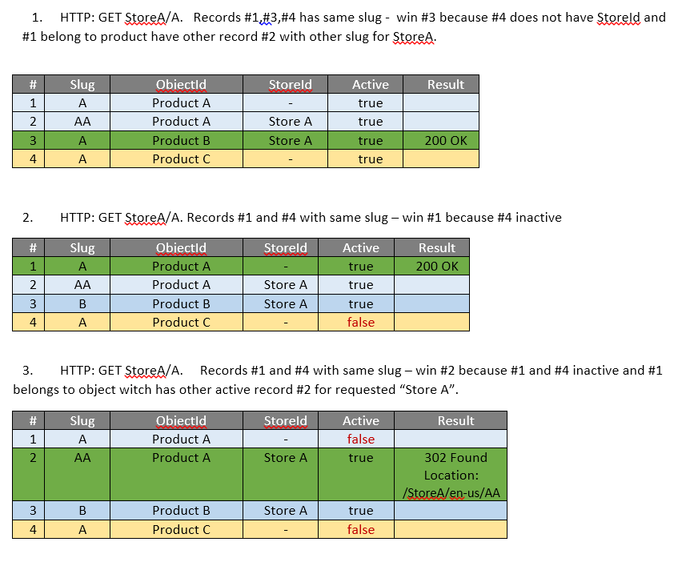

## Search Engine Optimization (SEO)

### Goals

<a class="crosslink" href="https://virtocommerce.com/ecommerce-marketing" target="_blank">SEO</a> is an important factor in an e-commerce site, marketing managers should be able to configure a site's URLs in a way that both the end user and search engines can understand. It also should support specifying the exact url for different languages.

* create simple URLs that shoppers and search engines can understand
* optimize page metadata to improve search engine page rank
* generate site maps to submit to search engine providers
* each page/product/category should be identifiable by a unique url (even language or store specific one)
* should support filtering SEO (filters should always appear in the same order)
* there should only be one URL for a page, every other URL should be automatically redirected

## Storefront url structure

Each storefront url has the following structure **/{store id?}/{locale?}/{path}** where:
* **{store id?}** - optional parameter can contains  requested <a class="crosslink" href="https://virtocommerce.com/multi-tenant" target="_blank">store id</a>, if not specified default store for this host will be used. Makes sense when one host have multiple stores. `http://localhost/electronics`, `http://localhost/clothing`.
* **{locale?}** - optional parameter represent <a href="https://msdn.microsoft.com/en-us/library/ee825488(v=cs.20).aspx" rel="nofollow">language culture name</a> (en-us, it-IT etc). Requested store should support specified language.
* **{path}** - request path witch handled by ASP.NET routing.

## Storefront slug URL resolution rules

