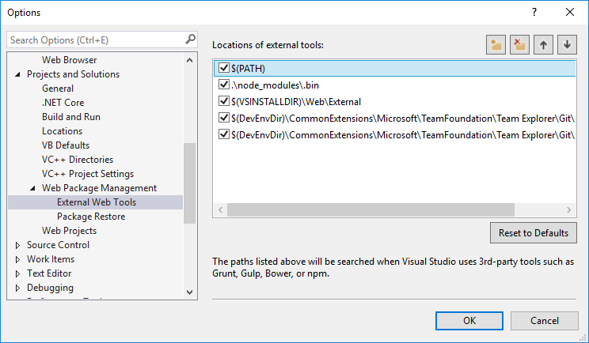

Whenever you are building theme for your client or yourself this guide will provide instructions on how to <a class="crosslink" href="https://virtocommerce.com/website-design" target="_blank">create a theme</a>.

There are several ways how the theme can be developed. You can start of with one of the sample themes provided with a product or download one from our [appstore](apps) or get on from <a href="https://themes.shopify.com/" rel="nofollow">Shopify themes</a> as these themes are fully supported. In this documentation, we will consider a [default theme](https://github.com/VirtoCommerce/vc-default-theme) for VirtoCommerce storefront.

## Getting started

1. Install [prerequisites](#prerequisites).
2. Clone repo.
    1. In Visual Studio, go to **Team Explorer** → **Clone** → Enter https://github.com/VirtoCommerce/vc-default-theme.git as URL and **'D:\vc-default-theme'** (for example) as path.
    2. Or execute command ```git clone https://github.com/VirtoCommerce/vc-default-theme.git "D:\vc-default-theme"``` (where **'D:\vc-default-theme'** is path to folder where you want to clone repo).
3. Link you theme repo to store. Execute:<br/>
```mklink /d "C:\vc-platform-master\VirtoCommerce.Platform.Web\App_Data\cms-content\Themes\Electronics\default" "D:\vc-default-theme"```
```mklink /d "C:\vc-storefront-master\VirtoCommerce.Storefront\App_Data\cms-content\Themes\Electronics\default" "D:\vc-default-theme"```
(where **'C:\vc-platform-master\VirtoCommerce.Platform.Web\App_Data\cms-content'** and **'C:\vc-storefront-master\VirtoCommerce.Storefront\App_Data\cms-content'** are paths to **'cms-content'** folders on platform and storefront, **'Electronics'** is your store name and **'D:\vc-default-theme'** is path to your theme repo).
4. Open theme folder in your IDE
    1. In Visual Studio (including 2017) go to  **File** → **Open** → **Website**
    2. In Visual Studio Code, go to **File** → **Open** → **Folder**
    3. Select **D:\vc-default-theme** (where **D:\vc-default-theme** is path to folder where you want to clone repo) and open it.
5. Install Node.js dependencies.
    1. In Visual Studio all dependencies will be installed automatically. Just wait a few minutes.
    2. In Visual Studio Code and other editors, you need to run ```npm install```to install Node.js dependencies.

## Appendix: CMS Content folder structure
<a href="../../../assets/images/docs/cms-content-structure.png"></a>

## Appendix: Prerequisites

### Storefront

You need to have local installation of storefront. Follow [this article](docs/vc2devguide/deployment/storefront-deployment/storefront-source-code-getting-started) step-by-step to install storefront from binaries or source code.

### Visual Studio 2015.3 and above (up to Visual Studio 2017.3 at least)

If you have Visual Studio 2015 with Update 3 and above, you don't need install any prerequisites. Latest versions of Node.js and Gulp already included in your Visual Studio installation and supported in built-in Task Runner Explorer.

### Visual Studio from 2015 up to 2015.2

Task Runner Explorer, Node.js and Gulp already included in your Visual Studio installation. However, you need update your Node.js to at least 4.0.0.
1. Update Node.js to v4.0.0 at least (we recommend [latest LTS version](https://nodejs.org/en/)). Use **C:\Program Files\nodejs** installation path (change **Program Files** to **Program Files (x86)** on 64-bit machine).
2. Add Node.js installation path to External Web Tools or move **$(PATH)** to top: 

### Visual Studio from 2013.3 up to 2013.5

You need install:
1. [Task Runner Explorer](https://marketplace.visualstudio.com/items?itemName=MadsKristensen.TaskRunnerExplorer) Visual Studio extension
2. Install Node.js v4.0.0 or above (we recommend [latest LTS version](https://nodejs.org/en/))
3. ```npm install gulp -g```

### Visual Studio Code and other editors

1. Install Node.js v4.0.0 or above (we recommend [latest LTS version](https://nodejs.org/en/))
2. ```npm install gulp -g```

## Bundles Reference

Bundling is a technique you can use to improve request load time. Bundling improves load time by reducing the number of requests to the server (assets such as CSS and JavaScript will be combined to single file per file format). To learn how to work with bundles go to [Bundles documentation](docs/vc2devguide/working-with-storefront/bundles).

## Liquid Reference

Liquid is the templating engine that powers Virto Commerce templates. Go to [Liquid documentation](docs/vc2devguide/working-with-storefront/theme-development/liquid-reference).
