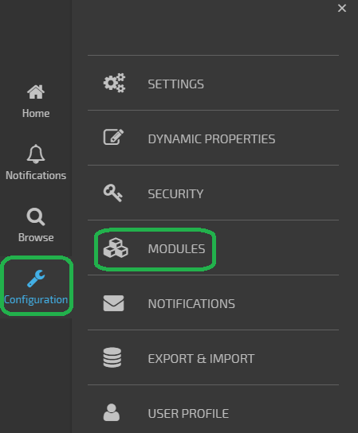
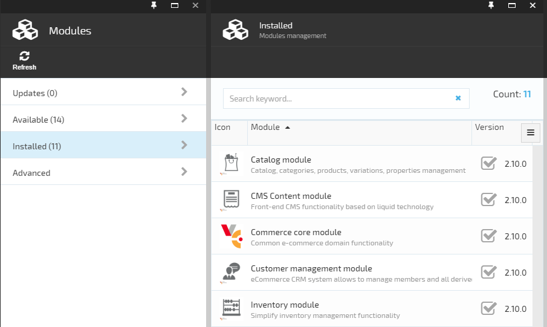
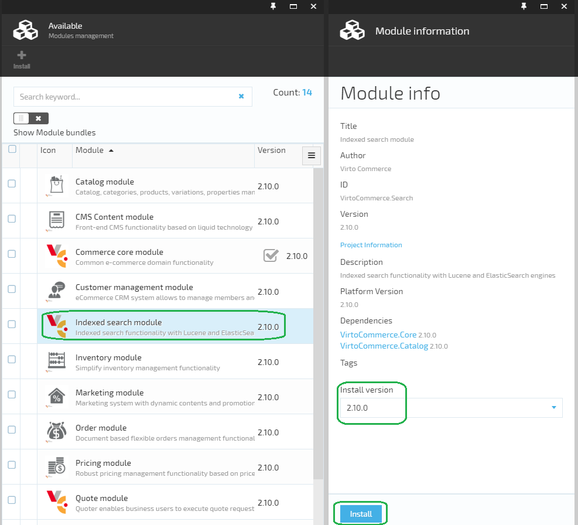
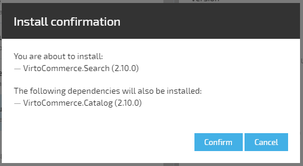
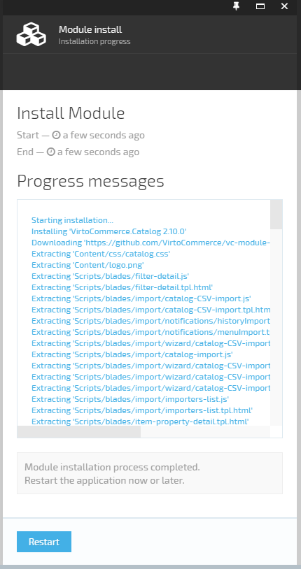
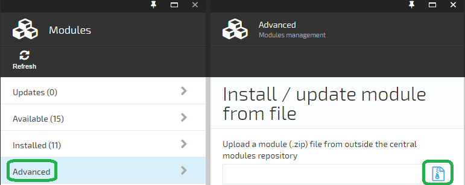

## Introduction

Modules management UI is accessible in Virto Commerce (VC) Manager: in the left menu click **Configuration** > **Modules**:

Modules management UI is displayed:

 

The available module **updates**, all the **available **and **installed** modules are showcased. There is also an **Advanced** option for manual module installation.

## Module installation

Navigate to** Available **tab, select a module from the list, review it's information, select "Install version" (as there might be multiple versions available) and click **Install **button:

 

Some modules may require to accept a license agreement before proceeding.

 

The system resolves the module dependencies (if any), checks version compatibility, etc. A list of modules (and dependency modules) to install is displayed in the install confirmation dialog: 

Click **Confirm** button to start the installation process. The installation progress is displayed:

The ***Restart ***button gets activated only after the installation process has completed. Click ***Restart ***to finish the installation and apply the changes. The new module(s) should appear in the **installed** modules list.

## Multiple modules installation

Multiple modules can be installed at once from the modules list: mark the proper modules by checkboxes and click **Install** in the toolbar. Proceed the same way as described in "**Module installation**" section (from install confirmation dialog).

You can also view the available modules grouped by various usage scenarios. Switch the*** Show Module bundles*** switcher on, select the whole group by a single click and proceed with the installation as usual.

## Manual module installation

Navigate to** Advanced** tab, click **Browse** button and select a module package (.zip) file to install:

The package will be uploaded to the server where its analysis takes place. Proceed the same way as described in "**Module installation**" section.

## Dependencies

### Platform dependency

Each module declares the minimal supported platform version.

If your platform version is less than required version, the module installation will report an error and fail.

### Module dependencies

Some modules may depend on other modules. If these dependencies are not installed and are absent in the **available** modules list, you will see an error message. In this case you have to obtain and install the dependency first.

 

