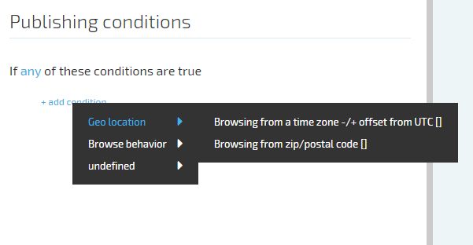
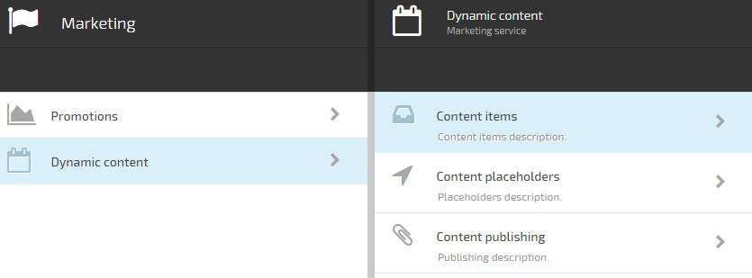
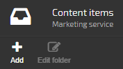
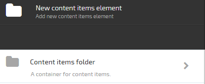
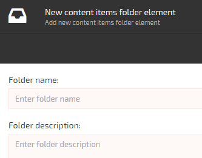
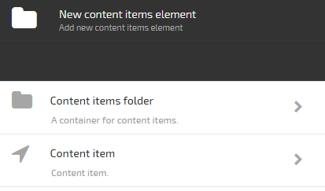
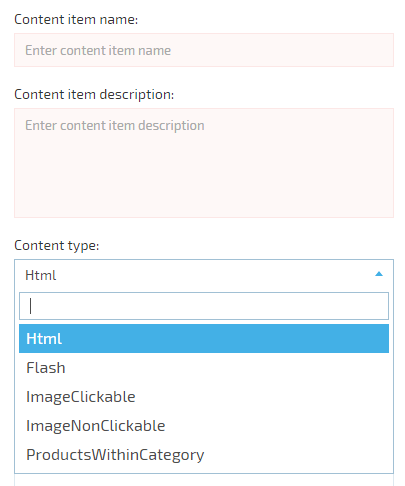
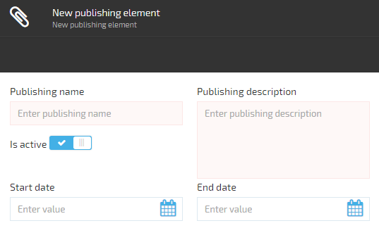
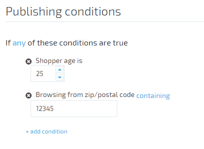
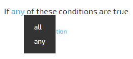

## Introduction

The Dynamic Content feature allows marketers to create personalized shopping experiences for customers. Using this feature, you can deliver elements of a shopping experience based on a set of conditions or context.

To determine the conditions under which Dynamic Content will be shown to a customer, you need to consider:
* What content to display
* Who will see the content
* When should the content be displayed
* Where should the content be displayed

An example of Dynamic Content is the display of a USB memory stick, targeting customers who arrived at your frontend store from a search engine for "USB memory". In this example, Dynamic Content retrieves the image of the USB memory, along with the product price from the catalog database and displays it only to the customers that match the target conditions.

Dynamic Content is configured using the <a class="crosslink" href="https://virtocommerce.com/b2b-ecommerce" target="_blank">Virto Commerce</a> platform manager so that marketing personnel can set up Dynamic Content without relying on developers and server administrators. For images and Flash animations, you may need a graphic designer to create the file and upload it to the Assets. However, once that's done, the marketer can configure rules for displaying it without any assistance.

## Concepts

Traditionally, Marketing relies on a web designer to create the layout of each page of a store website. The web developer sets frames, links, promotions and other visual stuff layout in a specific arrangement. Dynamic Content allows marketing to change the content within that layout dynamically, without involving the web developer beyond the initial set up of the page layout. Initially, the web developer will set up placeholders named **Content placeholders** on the page for Dynamic Content.

There are four interdependent components in Dynamic Content:
* Dynamic Content
* Content publishing
* Content type
* Content Placeholder

The first two components, Dynamic Content and Content Publishing, are set up through the Virto Commerce platform manager by a marketer. The Dynamic Content provides a name for and a description of the type of content to be displayed. The Content publishing object tells the system when, under what conditions and in which placeholder the dynamic content should be displayed.

The **Content Placeholders**, are also created through Virto Commerce platform manager but they are created by developers, web designers and system management personnel. Once a web developer has added a Content Place to a template, the developer or another user with appropriate permissions must register it in Virto Commerce platform manager.

## Content types

A Content type is a template used to define a Dynamic Content Type. It describes how a particular content type is displayed and what information is required to display it. Virto Commerce includes several Content types for the most common types of Dynamic Content. For example, there is a Content type to display images with links (banner) another to display product data (product with image and price).

The following Dynamic Content Types are shipped with Virto Commerce out-of-the-box. Each requires one or more parameter values to specify things such as, what image file should display or what the target web page should display when clicked.

|Content type|Description|Parameters|
|------------|-----------|----------|
|Flash|Displays an animated Flash file that cycles through three images. This Flash animation shows each of three images in succession, each having a clickable link that shows the shopper a different promotion. You will need to specify the URLs for each link within the Flash file.|**FlashFilePath** - path to the Flash animation file, **Link1Url**, **Link2Url**, **Link3Url** - enter the complete URL to the target page (item, promotion etc)|
|Html|Displays HTML content.|**RawHtml** - enter raw Html formatted text here|
|ImageClickable|Displays an image that can be clicked to perform some action. For example, redirect to another page, product or promotion.|**Alternative text** - text if the image can not be displayed. **ImageUrl** - link to the image. **TargetUrl** - link to the target when image clicked. **Title** - text (optional)|
|ImageNonClickable|Displays an image. For example, use this type to alert customers to a <a class="crosslink" href="https://virtocommerce.com/shopping-cart" target="_blank">shopping cart</a> promotion that will give them a discount on checkout.|**Alternative text** - text if image can not be displayed. **ImageFilePath** - path to the image file|
|ProductsWithinCategory|Displays products of the category as slideshow|**Category code** - code of the category. **Title** - user friendly title of the category. **Item count** - how many items will be presented in the slideshow. **New items** - switch to show only new items.|

## Content placeholders

Content Placeholders is a location within an HTML page that can display Dynamic Content. You can think of it as the physical space on the storefront page where the Dynamic Content specified by the Content types appears.

Content Placeholders are created by web developers in templates. Once they have been created in the template, a user with Marketing/DynamicContent/ContentPlaceholders permissions (Administrator) [must register the Content Placeholder in Virto Commerce platform manager](docs/vc2userguide/marketing/dynamic-content/registering-content-placeholders), using the same name as the Content Placeholder in the template. It is this registered entry that is selected as a target Content Placeholder by a Marketer when he creates and configures a Dynamic Content.

## Tags

Dynamic Content shows specific content to targeted customers. The system determines the customers properties via Tags. Virto Commerce incorporates tagging system that is used to set and evaluate tags that you can use to segment Customers, and to decide when, where and to which Customer to display content. The tagging data about a customer is captured in a variety of ways, including:

* Information provided in a registered user’s customer account
* Information entered by a Customer Service about a customer during a customer service call
* Target and Referring URLs and search terms captured when the user clicks a link to bring them to a storefront
* Customer Geo location

Information captured by the tags is stored in the user’s session while he shops in an storefront. The information can then be used to evaluate whether the customer meets conditions set for displaying Dynamic Content. Tag information is captured only when the customer first visits a storefront during a browser session.

A Marketer or other Manager user with granted Dynamic Content permissions, uses the tags when creating conditions that determine whether a customer will see a piece of Dynamic Content or not.

Virto Commerce is shipped with the most commonly used tags. The following tag groups are included with Virto Commerce:

* Browse Behavior
* Customer Profile
* Geo location

## Condition operators

By default, condition statements within a statement block are inclusive. They are considered to be joined by an **all** clause unless explicitly joined by a **any** operator.

Tag operators for Dynamic Content conditions are either string or integer.

* matching implies that the characters in the value for the tag must match those returned by the tag in order for the condition to be **true**. (the match is NOT case-sensitive.)
* contains operator is **true** if the value set for the condition is found anywhere within the returned string.
* matching (case sensitive) and contains (case sensitive) perform their expected match or includes operations but will only evaluate to **true** if the founded values match the upper and lower case characters of those searched.

## Working with Dynamic Content

Virto Commerce platform manager main tasks concerning Dynamic Content or Dynamic Content management and Content Publishing management. Once created Dynamic Content can be reused as many times as required in Content Publishing items.

Creating Dynamic Content in Virto Commerce management application specifies what Content to deliver (e.g. Image, Clickable image, Flash etc.) and setting up its parameters.

Creating Content Publishing specifies which Dynamic Content(s) to view and conditions under which the Dynamic Content should be available.

> Dynamic Content won't be available in frontend until it's not assigned to any of the Content Publishing item.

## Creating Dynamic Content item

Creating Dynamic Content in Virto Commerce platform manager requires that you provide a name for the Dynamic Content, select a Content type and provide values for the type’s parameters.

* Open Marketing module.
* Select **Dynamic Content** from the list.
* Select **Content items** from the list.  

* Click **Add** button.  

* Creating dynamic content item for the first time you need to create folder to store the dynamic content. Click the only item "Content items folder" to enter folder creation wizard.  

* Enter name and description for the folder.  

* Once the folder created it will appear in the list of folders. Navigate to the just created folder and click **Add** button there in the toolbar. Now you have option to create Dynamic **Content item**.  

* Select **Content item**
* In the wizard set the required properties. Some will depend on the content type user selects.  
  

> Select the right Content type that matches the content you want to add.

* Click **Create** in the bottom of the wizard blade.
* The just created content item should appear in the list of items of the folder.

## Editing Dynamic Content

* Open **Marketing module**.
* Select **Dynamic content**.
* Navigate to the Content item you need to edit.
* Click the selected Dynamic content item.
* Edit the required fields.
* Save changes.

> You can't edit Content type of the Dynamic Content as it would change all the sensitive properties of the item.

## Deleting Dynamic Content

* Open **Marketing module**.
* Select **Dynamic content**.
* Navigate to the content item to delete.
* Click **Delete** in the toolbar.
* Confirm deletion.

> Only Dynamic Content that doesn't belong to any of Content publishing can be deleted otherwise the message will be shown that the associated Content Publishing should be deleted first.

## Creating Content Publishing

Content publishing sets the delivery conditions of the Dynamic Content. Therefore before creating Content Publishing the required Dynamic Content and Content Place should be registered (created) in the system.

* Open **Marketing** Module
* Select **Content publishing**
* Click **Add** button

* In the wizard blade setup the Content Publishing Name, Description, Priority, Activity and Availability dates.

**Name** and **Description** fields are self explanatory. The main suggestion is to use meaningful name to easily find the Content Publishing in the future. The good example of name is "15% Christmas discount for TVs", the bad is "Content Publishing 17". **Priority** property sets the priority of the Content Publishing. If more than one Dynamic Content configured to be displayed in the Content Place at some conditions, the Dynamic Content configured in the Content Publishing with higher priority will be displayed.
**Is Active** property sets activity of the Content Publishing. If checkbox not checked the Dynamic Content set in the Content Publishing won't be available in the front-end. **Available from** and **Available to** sets the dates range when the Content should be available. These properties are useful to set banners for promotions that are limited by dates (e.g. banner for promotion that is active until Christmas should be available only up to 25 of December. If the Content should be displayed always, just leave those fields blank.
* Next set Content Placeholder(s) where the Dynamic Content should be displayed.
Click Placeholders to add/edit placeholders for the content publishing

* Choose placeholders in the opened blade.

> Content Placeholders are predefined by the personnel that has permissions to register Content Placeholders in the system.

> More than one Content Placeholder can be selected if the Dynamic content should be displayed in more than one Content Placeholder.

* After the required Content has been selected click **Content items**.

* In the opened blade choose Dynamic Content items that should be displayed.

> More than one Content item can be selected if the more than one Content item should be displayed.

* The last step is to setup conditions in which the dynamic content should be published.

By default the Dynamic Content will be displayed to any customer that viewed the page with the selected Content Placeholder. If the Dynamic Content should be displayed under specified conditions set them in this step using Expression builder.
* After all conditions has been set, if any, click **Create** in the bottom of the wizard blade.

The created Content Publishing should appear in the list.

## Expression builder

Expression builder is used to create a human readable conditions set under which the Dynamic Content should be displayed.

Expression builder consists of two main parts. The first is the global operator for the whole conditions set. It sets if the expression returns **true** if any of the conditions satisfied or if all of the conditions are satisfied. The behavior is set using **all/any** operand.

The second part is the conditions collection. Available conditions are grouped into four groups:
* Browse Behavior
* Customer Profile
* Geo location
* <a class="crosslink" href="https://virtocommerce.com/shopping-cart" target="_blank">Shopping cart</a>

Names of the conditions under those groups are self-explanatory. Values of the conditions can be of two types string and decimal.

Thus operators for string value conditions can be:
* matching (means the value of the context appropriate Tag should match the entered value)
* contains (means the value of the context appropriate Tag should contain the entered value. The comparison is case-invariant)
* not matching (means the value of the context appropriate Tag should not match the entered value).
* not contains (means the value of the appropriate context Tag should not contain the entered value. The comparison is case-invariant)

Operators for decimal value conditions can be:
* greater than (means the value of the appropriate context Tag should be greater than the entered value)
* greater than or equals (means the value of the appropriate context Tag should be greater than or equals the entered value)
* less than (means the value of the appropriate context Tag should be less than the entered value)
* less than or equals (means the value of the appropriate context Tag should be less than or equals the entered value)
* matching (means the value of the appropriate context Tag should match the entered value)

There are special conditions that uses system values.

Example of special condition is **Shopper gender**, which can only be **male** of **female**. Thus only those two options available.

To add a new condition to the expression click "**+ add condition**". The menu with condition groups will appear. Hover the required group the conditions of the group will expand. Click the required condition. It will appear in the expression builder. Set the operator and operand values of the condition. If you need to setup more conditions click "**+ add condition**" and add conditions as many times as many conditions you need.

## Editing Content Publishing

* Open **Marketing** module.
* Select **Dynamic content**.
* Select **Content publishing**.
* Click the selected Content publishing.
* Edit the required fields.
* Save changes.

## Deleting Content Publishing

* Open **Marketing** module.
* Select **Dynamic content**.
* Select **Content publishing**.
* Select the Content publishing you want to delete.
* Click **Delete** button in the toolbar.
* Confirm deletion.